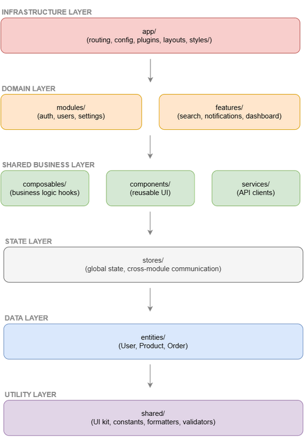

# Vue Project Modules Blueprint

This document provides recommendations for structuring Vue projects using **modules**.  
A module represents a domain (e.g., `auth`, `users`, `notifications`) and may contain **views, components, services, composables, and stores**.

## Key Concepts

- **Modules** = Domain-specific folders containing related functionality
- **Global assets** = Reusable code accessible by all modules (components/, composables/, entities/, features/)
- **App infrastructure** = Framework setup and configuration (app/ folder)
- **Shared utilities** = Basic UI kit and utility functions (shared/ folder)

## Example Project Structure

```plaintext
src/
├── app/                      # Infrastructure and global setup
│   ├── router/               # Route registration
│   │   └── index.ts
│   ├── stores/               # App-level store configuration
│   ├── plugins/              # Global plugins (axios, i18n, etc.)
│   ├── layouts/              # App-level layouts (DefaultLayout.vue, AuthLayout.vue)
│   └── App.vue               # Application root component
│
├── components/               # Global business components (not basic UI)
│   ├── layout/               # Layout-related business components
│   └── form/                 # Complex form components
│
├── views/                    # Global pages (not module-specific)
│   ├── HomeView.vue
│   ├── AboutView.vue
│   ├── NotFoundView.vue
│   └── ErrorView.vue
│
├── composables/              # Global reusable composables
│   ├── server.ts
│   ├── auth.ts
│   └── localStorage.ts
│
├── services/                 # Global API clients and business logic services
│   ├── auth.ts
│   ├── users.ts
│   ├── notifications.ts
│   └── jsonrpc/              # Services can have subdirectories for organization
│       └── config.ts
│
├── entities/                 # Global business entities
│   ├── base/
│   ├── User.ts
│   └── Permission.ts
│
├── stores/                   # Global stores (cross-module state)
│   ├── app.ts
│   ├── user.ts
│   └── settings.ts
│
├── features/                 # Global reusable features
│   ├── search/
│   │   └── index.ts          # MANDATORY - Public API exports
│   ├── file-upload/
│   │   └── index.ts          # MANDATORY - Public API exports
│   ├── data-table/
│   │   └── index.ts          # MANDATORY - Public API exports
│   └── notifications/
│       └── index.ts          # MANDATORY - Public API exports
│
├── modules/
│   ├── auth/                 # Route-based module
│   │   ├── views/
│   │   │   ├── LoginView.vue
│   │   │   ├── RegisterView.vue
│   │   │   └── ForgotPasswordView.vue
│   │   ├── components/
│   │   │   └── LoginForm.vue
│   │   ├── services/
│   │   │   └── auth.ts
│   │   ├── composables/
│   │   │   └── Login.ts
│   │   ├── stores/
│   │   │   └── auth.ts
│   │   ├── entities/         # Business/domain entities for auth
│   │   ├── routes.ts
│   │   ├── menu.ts
│   │   └── index.ts          # MANDATORY - Public API exports
│   │
│   ├── users/                # Another route-based module
│   │   ├── views/
│   │   │   ├── UserListView.vue
│   │   │   ├── UserDetailView.vue
│   │   │   └── UserEditView.vue
│   │   ├── components/
│   │   │   └── UserTable.vue
│   │   ├── services/
│   │   │   └── users.ts
│   │   ├── composables/
│   │   │   └── useUsers.ts
│   │   ├── stores/
│   │   │   └── users.ts
│   │   ├── entities/         # Business/domain entities for users
│   │   ├── routes.ts
│   │   ├── menu.ts
│   │   └── index.ts          # MANDATORY - Public API exports
│   │
│   ├── notifications/        # Logic-only module (no views)
│   │   ├── composables/
│   │   │   └── useNotifications.ts
│   │   ├── components/
│   │   │   └── Toast.vue
│   │   ├── stores/
│   │   │   └── notifications.ts
│   │   ├── entities/         # Business/domain entities for notifications
│   │   └── index.ts          # MANDATORY - Public API exports
│   │
│   └── settings/             # Mixed module (routes + logic)
│       ├── views/
│       │   └── SettingsView.vue
│       ├── services/
│       │   └── settings.ts
│       ├── composables/
│       │   └── useSettings.ts
│       ├── entities/         # Business/domain entities for settings
│       └── index.ts          # MANDATORY - Public API exports
│
├── shared/                   # Cross-module utilities and UI kit
│   ├── ui/                   # Basic UI kit (buttons, inputs, forms, etc.)
│   ├── constants.ts          # App-wide constants
│   ├── formatters.ts         # Data formatting utilities
│   ├── validators.ts         # Validation functions
│   ├── helpers.ts            # General helper functions
│   └── types.ts              # Shared TypeScript types
│
└── main.ts                   # Application entry point
```

### Store Organization

The project uses a three-tier store architecture:

- **Global stores** (`stores/`) - Cross-module state shared between multiple modules
- **App-level stores** (`app/stores/`) - Application configuration and setup stores
- **Module stores** (`modules/*/stores/`) - Module-specific state that stays within the module

```ts
// Example store organization:
stores/
├── app.ts           # Global app state (theme, language, etc.)
├── user.ts          # Global user state (current user, permissions)
└── settings.ts      # Global settings (app-wide preferences)

app/stores/
└── pinia.config.ts        # Store configuration and setup

modules/auth/stores/
└── auth.ts          # Auth-specific state (login form, tokens)
```

## Mandatory Public API Files

**Every module AND global feature MUST have an `index.ts` file** that serves as its public API interface. This is the **ONLY** file that other layers can import from modules and global features.

**Note**: Internal features within modules (e.g., `modules/users/features/user-invite/`) do NOT require public API since they are internal to the module.

### Public API Structure

```ts
// modules/auth/index.ts - MANDATORY PUBLIC API
export { default as moduleRoutes } from './routes'
export { default as moduleNavigation } from './menu'
export { AuthPlugin } from './plugins/auth-plugin'
export { Login } from './composables/login'

// Optional: re-export types if needed by other layers
export type { AuthConfig, AuthState } from './types'
```

```ts
// features/search/index.ts - MANDATORY PUBLIC API
export { default as SearchInput } from './components/SearchInput.vue'
export { default as SearchResults } from './components/SearchResults.vue'
export { default as SearchFilters } from './components/SearchFilters.vue'
export { useSearch } from './composables/search'
export { searchAPI } from './services/search'

// Optional: re-export types if needed by other layers
export type { SearchResult, SearchFilters } from './entities/SearchResult'
```

### Enforcement Rules

- **✅ App layer CAN import**: `@/modules/auth` (uses index.ts)
- **✅ App layer CAN import**: `@/features/search` (uses index.ts)
- **✅ Module CAN import**: `./features/user-invite/UserInviteForm.vue` (internal feature, no public API needed)
- **❌ App layer CANNOT import**: `@/modules/auth/routes` (direct file access)
- **❌ App layer CANNOT import**: `@/features/search/components/SearchInput.vue` (bypasses public API)
- **❌ Any layer CANNOT import**: `@/modules/auth/components/LoginForm.vue` (bypasses public API)
- **❌ Features CANNOT import**: `@/features/search/composables/search.ts` (cross-feature direct access)

**Key Principle:** All modules and global features should export consistent interfaces:

- **Modules**: `moduleRoutes` for routing, `moduleNavigation` for menu items
- **Global Features**: Feature-specific exports with descriptive names (e.g., `SearchInput`, `useSearch`, `searchAPI`)
- **Internal Features**: No public API required - directly accessible within their parent module
- Module and feature-specific exports can use descriptive names based on their domain

### Benefits of Mandatory Public APIs

- **True Encapsulation**: Internal module and global feature files are completely hidden from other layers
- **Controlled Interface**: Modules and global features explicitly define what they expose
- **Breaking Change Protection**: Internal refactoring doesn't affect integrations
- **Self-Documenting**: index.ts serves as module/global feature API documentation
- **Easier Maintenance**: Clear separation between public and private code
- **Consistent Architecture**: Same pattern for both modules and global features

**Note**: Components, composables, entities, and shared utilities remain directly accessible as they are global resources designed for cross-module usage. Internal features within modules don't require public API since they are encapsulated within their parent module.

## Testing and test folder exceptions

Tests often need deeper access to implementation details. Test code is automatically allowed to import from any layer — including internal module files — to make unit and integration testing practical.

**Automatic Test File Detection**: The ESLint rules automatically detect test files and allow them unrestricted imports. This includes:

- Files in `tests/` directories (e.g., `tests/unit/auth.test.js`, `/project/tests/integration/`)
- Files with `.test.` in the name (e.g., `component.test.js`, `utils.test.ts`)
- Files with `.spec.` in the name (e.g., `component.spec.js`, `utils.spec.ts`)
- Files in `__tests__/` directories (e.g., `src/__tests__/setup.js`, `src/components/__tests__/Button.js`)

**No additional configuration required** - test files are detected automatically and exempt from import boundary restrictions.

Recommended patterns:

- Unit tests: importing internal files directly is acceptable to test implementation specifics.
- Integration tests: prefer exercising modules/features through their public API (`index.ts`) to validate real integration points.
- Test helpers: create a `tests/test-utils.ts` or `tests/utils/` that re-exports common setup/mocks; prefer adapters that call public APIs when feasible to ease refactors.
- Organization: keep internal-focused tests separate (e.g. `tests/internal/`) from cross-module/integration tests.

For custom test patterns not covered by automatic detection, you can still use the `allow` option in ESLint rule configurations to whitelist specific patterns.

Keep test-only imports clearly flagged as test code and out of production bundles (tests should not accidentally ship in the app). These exceptions exist to improve testability without weakening runtime architectural guarantees.

## What belongs where?

### Within each module

- **views/** → Pages mapped to routes (e.g., `LoginView.vue`, `UserListView.vue`).
- **components/** → UI parts specific to the module (not shared globally).
- **services/** → API calls or domain logic (e.g., `auth.ts`, `index.ts`, `frameMessages.ts`).
- **composables/** → Hooks with stateful or computed logic (e.g., `users.ts`).
- **store/** → Module-specific Pinia/Vuex stores (e.g., `auth.ts`).
- **entities/** → Business/domain entities specific to this module.
- **routes.ts** → Defines routes for this module.
- **menu.ts** → Navigation items for this module (if applicable).

**Note:** Global stores (shared across modules) go in `app/stores/`, while module-specific stores go in `modules/<module-name>/store/`.

**Store Stability Principle:** Root stores (`app/stores/` or `src/stores/`) serve as the **foundational stability layer** for cross-module communication. They should have:

- **Minimal, stable public APIs** that rarely change
- **Backward-compatible evolution** (additive changes only)
- **Well-defined interfaces** that multiple modules depend on
- **Long-term consistency** as they are the primary integration points between modules

Changes to root stores affect multiple modules, so they require careful consideration and should follow semantic versioning principles.

## Routing Registration

### The Routing Challenge

**Problem:** Routing inherently requires knowing about module routes, but layer access rules forbid `app/` importing from `modules/`. Even registry patterns require _someone_ to import modules to trigger registration.

### Solution 1: Convention-Based Auto-Discovery (Recommended)

Use file system conventions and dynamic imports to automatically discover and load module routes without any explicit imports:

```ts
// app/router/auto-discovery.ts
import type { RouteRecordRaw } from 'vue-router'

export async function discoverModuleRoutes(): Promise<RouteRecordRaw[]> {
  const routes: RouteRecordRaw[] = []

  // ✅ CORRECT - Use Vite's glob import to discover module index.ts files (public API)
  const modulePublicApis = import.meta.glob('/src/modules/*/index.{ts,js}')

  for (const path in modulePublicApis) {
    try {
      const module = (await modulePublicApis[path]()) as { moduleRoutes?: RouteRecordRaw[] }
      if (module.moduleRoutes) {
        console.log(`✅ Loaded routes for module: ${path.split('/')[3]}`)
        routes.push(...(Array.isArray(module.moduleRoutes) ? module.moduleRoutes : [module.moduleRoutes]))
      }
    } catch (error) {
      console.error(`❌ Failed to load module from ${path}:`, error)
    }
  }

  return routes
}
```

```ts
// app/router/index.ts
import { createRouter, createWebHistory } from 'vue-router'
import { discoverModuleRoutes } from './auto-discovery'

export async function createAppRouter() {
  const moduleRoutes = await discoverModuleRoutes()

  return createRouter({
    history: createWebHistory(),
    routes: [
      // App-level routes
      { path: '/', redirect: '/dashboard' },
      { path: '/404', component: () => import('@/shared/components/NotFound.vue') },

      // Auto-discovered module routes
      ...moduleRoutes,

      // Catch-all
      { path: '/:pathMatch(.*)*', redirect: '/404' },
    ],
  })
}
```

```ts
// main.ts - Still thin, no module imports!
import { createApp } from 'vue'
import { createAppRouter } from './app/router'
import App from './App.vue'

const app = createApp(App)
const router = await createAppRouter()

app.use(router).mount('#app')
```

### Solution 2: Configuration-Based Discovery

Define modules in configuration and load routes dynamically:

```ts
// app/config/modules.ts
export const enabledModules = [
  'auth',
  'users',
  'settings',
  // Add new modules here when needed
] as const

export type ModuleName = (typeof enabledModules)[number]
```

```ts
// app/router/module-loader.ts
import type { RouteRecordRaw } from 'vue-router'
import { enabledModules } from '@/app/config/modules'

export async function loadModuleRoutes(): Promise<RouteRecordRaw[]> {
  const routes: RouteRecordRaw[] = []

  for (const moduleName of enabledModules) {
    try {
      // Dynamic import - no static dependency on modules
      const moduleRoutes = await import(`@/modules/${moduleName}/routes.ts`)
      routes.push(...moduleRoutes.default)
    } catch (error) {
      console.warn(`Module ${moduleName} routes not found or failed to load:`, error)
    }
  }

  return routes
}
```

```ts
// app/router/index.ts
import { createRouter, createWebHistory } from 'vue-router'
import { loadModuleRoutes } from './module-loader'

export async function createAppRouter() {
  const moduleRoutes = await loadModuleRoutes()

  return createRouter({
    history: createWebHistory(),
    routes: moduleRoutes,
  })
}
```

### Solution 3: Build-Time Route Generation

Use a build plugin to generate routes at build time:

```ts
// vite.config.ts
import { defineConfig } from 'vite'
import { generateModuleRoutes } from './build/route-generator'

export default defineConfig({
  plugins: [
    generateModuleRoutes(), // Scans modules and generates route file
    // ... other plugins
  ],
})
```

```ts
// Generated file: app/router/generated-routes.ts (auto-generated)
export const moduleRoutes = [
  { path: '/auth/login', component: () => import('@/modules/auth/views/LoginView.vue') },
  { path: '/users', component: () => import('@/modules/users/views/UserListView.vue') },
  // ... auto-generated by scanning module files
]
```

### Key Benefits of These Solutions

- ✅ **No direct imports** from app to modules
- ✅ **Maintains layer isolation**
- ✅ **Auto-discovery** of new modules
- ✅ **Keeps main.ts thin**
- ✅ **Dynamic module loading** support

```ts
// main.ts - Stays thin and focused
import { createApp } from 'vue'
import { router } from './app/router'
import App from './App.vue'

createApp(App).use(router).mount('#app')
```

## Module Navigation

Each module defines its own `menu.ts` for menu items related to that module:

```ts
// modules/users/menu.ts
import type { MenuItem } from '@/app/types'

export const moduleNavigation: MenuItem[] = [
  {
    title: 'User List',
    description: 'Manage system users',
    icon: 'Users',
    route: ROUTES.USERS_LIST,
  },
  {
    title: 'User Roles',
    description: 'User roles and permissions',
    icon: 'Shield',
    route: ROUTES.USER_ROLES,
  },
]
```

The app menu aggregator imports all module-level navigation and merges them:

```ts
// app/menu/index.ts
import { moduleNavigation as authNav } from '@/modules/auth'
import { moduleNavigation as userNav } from '@/modules/users'
import { moduleNavigation as settingsNav } from '@/modules/settings'

export const navigation = [
  {
    title: 'Authentication',
    icon: 'Key',
    groups: [
      {
        title: 'General',
        items: [...authNav],
      },
    ],
  },
  {
    title: 'Users',
    icon: 'Users',
    groups: [
      {
        title: 'Management',
        items: [...userNav],
      },
    ],
  },
]
```

The sidebar component (e.g., `AppSidebar.vue`) consumes the aggregated menu and renders groups/items.

## Navigation Organization Patterns

### Navigation Structure Types

#### 1. Simple Navigation (Small Apps)

```ts
// app/navigation/index.ts
export const navigation = [
  { title: 'Dashboard', route: '/dashboard', icon: 'Home' },
  { title: 'Users', route: '/users', icon: 'Users' },
  { title: 'Settings', route: '/settings', icon: 'Settings' },
]
```

#### 2. Grouped Navigation (Medium Apps)

```ts
// app/navigation/index.ts
export const navigation = [
  {
    title: 'Management',
    items: [
      { title: 'Dashboard', route: '/dashboard', icon: 'Home' },
      { title: 'Users', route: '/users', icon: 'Users' },
      { title: 'Organizations', route: '/organizations', icon: 'Building' },
    ],
  },
  {
    title: 'System',
    items: [
      { title: 'Settings', route: '/settings', icon: 'Settings' },
      { title: 'Audit Logs', route: '/audit', icon: 'FileText' },
    ],
  },
]
```

#### 3. Hierarchical Navigation (Large Apps)

```ts
// app/navigation/index.ts
export const navigation = [
  {
    title: 'General',
    icon: 'Home',
    groups: [
      {
        title: 'Overview',
        items: [
          { title: 'Dashboard', route: '/dashboard', icon: 'BarChart' },
          { title: 'Analytics', route: '/analytics', icon: 'TrendingUp' },
        ],
      },
    ],
  },
  {
    title: 'User Management',
    icon: 'Users',
    groups: [
      {
        title: 'Administration',
        items: [
          { title: 'User List', route: '/users', icon: 'Users' },
          { title: 'User Roles', route: '/users/roles', icon: 'Shield' },
          { title: 'Permissions', route: '/users/permissions', icon: 'Key' },
        ],
      },
      {
        title: 'Organization',
        items: [
          { title: 'Companies', route: '/organizations', icon: 'Building' },
          { title: 'Departments', route: '/departments', icon: 'Layers' },
        ],
      },
    ],
  },
]
```

### Module-Based Navigation Assembly

#### Module Navigation Exports

```ts
// modules/users/menu.ts
export const moduleNavigation = {
  title: 'User Management',
  icon: 'Users',
  groups: [
    {
      title: 'Administration',
      items: [
        { title: 'User List', route: '/users', icon: 'Users', permission: 'users:read' },
        { title: 'User Roles', route: '/users/roles', icon: 'Shield', permission: 'roles:read' },
        { title: 'Invite Users', route: '/users/invite', icon: 'UserPlus', permission: 'users:create' },
      ],
    },
  ],
}

// modules/auth/menu.ts
export const moduleNavigation = {
  title: 'Authentication',
  icon: 'Key',
  groups: [
    {
      title: 'Security',
      items: [
        { title: 'Login Sessions', route: '/auth/sessions', icon: 'Clock', permission: 'auth:read' },
        { title: 'Password Policy', route: '/auth/policy', icon: 'Lock', permission: 'auth:manage' },
      ],
    },
  ],
}
```

#### Navigation Aggregator

```ts
// app/navigation/index.ts
import { moduleNavigation as userNav } from '@/modules/users'
import { moduleNavigation as authNav } from '@/modules/auth'
import { usePermissions } from '@/composables/permissions'

export function useAppNavigation() {
  const { hasPermission } = usePermissions()

  const moduleNavigations = [userNav, authNav]

  // Filter navigation items based on permissions
  const filteredNavigation = moduleNavigations
    .map((section) => ({
      ...section,
      groups: section.groups
        .map((group) => ({
          ...group,
          items: group.items.filter((item) => !item.permission || hasPermission(item.permission)),
        }))
        .filter((group) => group.items.length > 0),
    }))
    .filter((section) => section.groups.length > 0)

  return { navigation: filteredNavigation }
}
```

### Permission-Based Navigation

#### Navigation with Role-Based Access

```ts
// types/navigation.ts
export interface NavigationItem {
  title: string
  route: string
  icon: string
  permission?: string
  roles?: string[]
  badge?: {
    text: string
    variant: 'info' | 'warning' | 'success' | 'error'
  }
}

// app/navigation/guards.ts
export function filterNavigationByPermissions(
  navigation: NavigationItem[],
  userPermissions: string[],
  userRoles: string[],
): NavigationItem[] {
  return navigation.filter((item) => {
    // Check permission-based access
    if (item.permission && !userPermissions.includes(item.permission)) {
      return false
    }

    // Check role-based access
    if (item.roles && !item.roles.some((role) => userRoles.includes(role))) {
      return false
    }

    return true
  })
}
```

### Navigation Component Integration

#### Sidebar Navigation Component

```vue
<!-- components/AppSidebar.vue -->
<template>
  <nav class="sidebar">
    <div v-for="section in navigation" :key="section.title" class="nav-section">
      <h3 class="section-title">
        <Icon :name="section.icon" />
        {{ section.title }}
      </h3>

      <div v-for="group in section.groups" :key="group.title" class="nav-group">
        <h4 class="group-title">{{ group.title }}</h4>

        <ul class="nav-items">
          <li v-for="item in group.items" :key="item.route">
            <router-link :to="item.route" class="nav-link">
              <Icon :name="item.icon" />
              <span>{{ item.title }}</span>
              <Badge v-if="item.badge" :variant="item.badge.variant">
                {{ item.badge.text }}
              </Badge>
            </router-link>
          </li>
        </ul>
      </div>
    </div>
  </nav>
</template>

<script setup lang="ts">
import { useAppNavigation } from '@/app/navigation'

const { navigation } = useAppNavigation()
</script>
```

### Responsive Navigation Patterns

#### Breadcrumb Navigation

```ts
// composables/breadcrumbs.ts
export function useBreadcrumbs() {
  const route = useRoute()

  const breadcrumbs = computed(() => {
    const segments = route.path.split('/').filter(Boolean)
    const crumbs = []

    segments.reduce((path, segment) => {
      path += `/${segment}`
      const routeRecord = router.resolve(path)

      crumbs.push({
        title: routeRecord.meta?.breadcrumb || segment,
        path: path,
        isActive: path === route.path,
      })

      return path
    }, '')

    return crumbs
  })

  return { breadcrumbs }
}
```

This navigation organization system provides flexibility for apps of any size while maintaining module independence and supporting advanced features like permissions and responsive design.

## Naming Conventions

- **Views** → Always end with `View.vue` → `LoginView.vue`, `UserListView.vue`.
- **Components** → PascalCase, descriptive → `UserTable.vue`, `LoginForm.vue`.
- **Stores** → Use Pinia convention, start with lowercase letter: `user.ts`.
- **Composables** → Start with lowercase letter: `system.ts`.
- **Services** → Start with lowercase letter → `index.ts`, `auth.ts`, `frameMessages.ts`.
- **Entities** → `<domain>.ts` for business/domain entities (e.g., `User.ts`, `Settings.ts`).
- **Routes** → `routes.ts` inside module.

## Architectural Principles

### Layer-Based Access Control

The modular architecture follows a strict 6-layer hierarchy where each layer has specific accessibility rules:

#### Infrastructure Layer (`app/`)

- **Access**: Public API exports ONLY from Domain layers (via `index.ts`)
- **Purpose**: Application setup, routing, configuration, plugins, layouts, global styles (including TailwindCSS configuration)
- **Stability**: High - foundational infrastructure
- **Contains**: `router/`, `layouts/`, `styles/`, `config/` etc
- **Module Integration**: Strict public API enforcement - no direct file imports from modules/features
- **Note**: Pink background represents application foundation

#### Domain Layer (`modules/`, `features/`)

- **Access**: Can import from Shared Business, State, Data, and Utility layers
- **Purpose**: Business domains and feature-specific functionality
- **Isolation**: Strict - no cross-domain imports between modules/features
- **Contains**: `modules/auth/`, `modules/users/`, `features/search/`, `features/notifications/`
- **Note**: Yellow background represents domain-specific business logic

#### Shared Business Layer (`composables/`, `components/`, `services/`)

- **Access**: Can import from State, Data, and Utility layers
- **Purpose**: Reusable business logic, UI components, and API service clients
- **Cross-referencing**: ✅ Composables, components, and services can reference each other
- **Contains**: Business logic hooks, reusable UI components, API service clients (including global services in `services/`)
- **Note**: Green background represents shared business functionality

#### State Layer (`stores/`)

- **Access**: Can import from Data and Utility layers only
- **Purpose**: Global state management and cross-module communication
- **Stability**: High - application state kernel
- **Contains**: Pinia stores for global application state
- **Note**: Gray background represents state management layer

#### Data Layer (`entities/`)

- **Access**: Can import from Utility layer and cross-reference other entities
- **Purpose**: Pure data models, business objects, and domain entities, contains data related functionality like loaders, validation and transformation
- **Stability**: High - core data contracts
- **Contains**: User, Product, Order entities and data structures
- **Note**: Blue background represents data models

#### Utility Layer (`shared/`)

- **Access**: Self-contained - no imports from other layers
- **Purpose**: Pure utilities, UI kit, constants, formatters, validators
- **Organization**: Flat structure organized by purpose
- **Stability**: Highest - foundation utilities
- **Contains**: `shared/ui/`, `shared/constants.ts`, `shared/formatters.ts`, `shared/validators.ts`
- **Note**: Purple background represents utility foundation

## Layer Access Diagram

### Visual Hierarchy: Top-to-Bottom Dependency Flow



### Access Flow Legend

- **Downward Flow** - Layers can import from layers below them in the hierarchy
- **Infrastructure Access** - App layer has limited access to domain layer routing/navigation only via Public API
- **Cross-Reference** - Horizontal imports allowed within same layer (entities cross-ref entities, composables cross-ref components), but restricted between domain layers
- **Forbidden** - Cannot import from layers above or skip layers
- **Self-Contained** - Utility layer has no external imports

### Layer Color Coding

| **Color**       | **Layer**       | **Purpose**                                        |
| --------------- | --------------- | -------------------------------------------------- |
| 🔴 **Red/Pink** | Infrastructure  | App foundation (routing, config, styles)           |
| 🟡 **Yellow**   | Domain          | Business domains (modules, features)               |
| 🟢 **Green**    | Shared Business | Reusable logic (composables, components, services) |
| ⚫ **Gray**     | State           | Global state management (stores)                   |
| 🔵 **Blue**     | Data            | Data models (entities)                             |
| 🟣 **Purple**   | Utility         | Foundation utilities (shared)                      |

### Key Access Rules Summary

| **Layer**           | **Can Import From**                           | **Special Notes**                                  |
| ------------------- | --------------------------------------------- | -------------------------------------------------- |
| 🔴 **app/**         | All business layers + module public APIs ONLY | Module public API access via index.ts exports only |
| 🟡 **modules/**     | Shared Business, State, Data, Utility layers  | ❌ No cross-module imports                         |
| 🟡 **features/**    | Shared Business, State, Data, Utility layers  | ❌ No cross-feature imports                        |
| 🟢 **composables/** | Components, Services, State, Data, Utility    | Cross-reference with components and services       |
| 🟢 **components/**  | Composables, Services, State, Data, Utility   | Cross-reference with composables and services      |
| 🟢 **services/**    | Composables, Components, State, Data, Utility | Global services can import other global services   |
| ⚫ **stores/**      | Data, Utility layers                          | Global stores can import other global stores       |
| 🔵 **entities/**    | Other entities, Utility layer                 | Entity relationships allowed                       |
| 🟣 **shared/**      | Self-contained                                | Foundation layer - no imports                      |

**Note:** `app/styles/` is part of the infrastructure layer and managed by `app/` - no separate access control needed.

### Original Architectural Principles

1. **Module isolation:** Modules should not import from each other directly. Instead, shared functionality should be moved to global directories (`components/`, `composables/`, `entities/`, `features/`) or the `shared/` folder.
2. **Global accessibility:** Global assets (`components/`, `composables/`, `entities/`, `features/`) are accessible by all modules.
3. **UI kit separation:** Basic UI components (buttons, inputs, forms) belong in `shared/ui/`, while business components go in `components/`.
4. **Utilities only in shared:** The `shared/` directory is reserved for true utilities and the UI kit.
5. **Feature-based organization:** Group related functionality within modules.
6. **Layer respect:** Each layer can only import from allowed layers according to the access control matrix.

### Layer Access Control Matrix

| From ↓ / To →      | `app/` | `modules/` | `features/` | `composables/` | `components/` | `services/` | `stores/` | `entities/` | `shared/` |
| ------------------ | ------ | ---------- | ----------- | -------------- | ------------- | ----------- | --------- | ----------- | --------- |
| **`app/`**         | ✅     | 🔄         | 🔄          | ✅             | ✅            | ✅          | ✅        | ✅          | ✅        |
| **`modules/`**     | ❌     | ❌         | 🔄          | ✅             | ✅            | ✅          | ✅        | ✅          | ✅        |
| **`features/`**    | ❌     | ❌         | ❌          | ✅             | ✅            | ✅          | ✅        | ✅          | ✅        |
| **`composables/`** | ❌     | ❌         | ❌          | ✅             | ✅            | ✅          | ✅        | ✅          | ✅        |
| **`components/`**  | ❌     | ❌         | ❌          | ✅             | ✅            | ✅          | ✅        | ✅          | ✅        |
| **`services/`**    | ❌     | ❌         | ❌          | ❌             | ❌            | ✅          | ✅        | ✅          | ✅        |
| **`stores/`**      | ❌     | ❌         | ❌          | ❌             | ❌            | ❌          | ✅        | ✅          | ✅        |
| **`entities/`**    | ❌     | ❌         | ❌          | ❌             | ❌            | ❌          | ❌        | ✅          | ✅        |
| **`shared/`**      | ❌     | ❌         | ❌          | ❌             | ❌            | ❌          | ❌        | ❌          | ✅        |

#### Legend

- ✅ **Allowed** - Can import freely
- ❌ **Forbidden** - Cannot import
- 🔄 **Public API Only** - App can ONLY access module/feature public exports via index.ts

### App Layer Public API Access Rules

The `app/` layer has **strict public API access** to modules - everything must go through the module's public interface. Features, components, composables, entities, and shared utilities remain directly accessible as global resources.

#### Allowed App → Module Imports (Public API Only)

```ts
// ✅ ONLY via public module API (index.ts exports)
import { moduleRoutes, AuthPlugin, moduleNavigation } from '@/modules/auth'
import { moduleRoutes as userRoutes, UserManagement, moduleNavigation as userNav } from '@/modules/users'

// ✅ Or via default exports
import AuthModule from '@/modules/auth'
import UsersModule from '@/modules/users'

// ✅ Features and global resources via public API
import { SearchInput, useSearch } from '@/features/search'
import { FileUploader } from '@/features/file-upload'
import UserCard from '@/components/UserCard.vue'
import { useApi } from '@/composables/api'
```

#### Forbidden App → Module/Feature Imports

```ts
// ❌ Direct module file imports (must go through public API)
import authRoutes from '@/modules/auth/routes'
import authMenu from '@/modules/auth/menu'
import userRoutes from '@/modules/users/routes'

// ❌ Direct feature file imports (must go through public API)
import SearchInput from '@/features/search/components/SearchInput.vue'
import { useSearch } from '@/features/search/composables/search'

// ❌ Internal module components
import LoginForm from '@/modules/auth/components/LoginForm.vue'

// ❌ Internal composables
import { useAuth } from '@/modules/auth/composables/auth'

// ❌ Internal services
import { authAPI } from '@/modules/auth/services/auth'

// ❌ Internal stores
import { useAuthStore } from '@/modules/auth/store/authStore'

// ❌ Any internal module/feature file except index.ts
import anything from '@/modules/auth/internal-file'
import anything from '@/features/search/internal-file'
```

**Key Principle:** App layer can ONLY access modules through their **public API exports** in `index.ts`. All routes, menus, plugins, and other integrations must be explicitly exported by the module's public interface. Features and global resources remain directly accessible.

## Module Boundaries and Encapsulation

### What are "Boundaries"?

**Boundaries** in modular architecture define what parts of a module are **public** (accessible from outside) vs **private** (internal implementation). Good boundaries enable:

- **Loose coupling** between modules
- **High cohesion** within modules
- **Controlled interfaces** for integration
- **Independent evolution** of modules

### Public vs Private Module APIs

#### Public API Interface (ONLY Accessible via index.ts)

```typescript
// modules/auth/index.ts - PUBLIC API (ONLY allowed import)
export { default as moduleRoutes } from './routes'
export { default as moduleNavigation } from './menu'
export { AuthPlugin } from './plugins/auth-plugin'
export { default as AuthModule } from './auth-module'

// All app/ imports MUST go through this public interface:
// import { moduleRoutes, moduleNavigation, AuthPlugin } from '@/modules/auth'
```

#### Private Implementation Details (Internal Only - FORBIDDEN for app/ layer)

```typescript
// modules/auth/ - ALL PRIVATE (forbidden for app/ imports)
├── routes.ts              // ❌ PRIVATE - No direct imports from app/
├── menu.ts                // ❌ PRIVATE - No direct imports from app/
├── components/            // ❌ PRIVATE - Internal UI components
├── composables/           // ❌ PRIVATE - Internal business logic
├── services/              // ❌ PRIVATE - Internal API calls
├── store/                 // ❌ PRIVATE - Internal state management
├── entities/              // ❌ PRIVATE - Internal data structures
└── plugins/
    └── auth-plugin.ts     // ❌ PRIVATE - Must be exported via index.ts
```

### Strict Public API Enforcement

#### 1. Module Public API Definition

```ts
// modules/auth/index.ts - ONLY allowed import path from app/
export { default as moduleRoutes } from './routes'
export { default as moduleNavigation } from './menu'
export { AuthPlugin } from './plugins/auth-plugin'
export { default as AuthModule } from './auth-module'

// Optional: re-export types if needed by app/
export type { AuthConfig, AuthState } from './types'
```

#### 2. App Layer Integration (Correct)

```ts
// app/router/index.ts - ✅ CORRECT
import { moduleRoutes as authRoutes } from '@/modules/auth'
import { moduleRoutes as userRoutes } from '@/modules/users'
import { searchRoutes } from '@/features/search'

const routes = [...authRoutes, ...userRoutes, ...searchRoutes]

// app/plugins/index.ts - ✅ CORRECT
import { AuthPlugin, UserPlugin } from '@/modules/auth'
import { SearchPlugin } from '@/features/search'

app.use(AuthPlugin)
app.use(UserPlugin)
app.use(SearchPlugin)
```

#### 3. App Layer Integration (Incorrect - FORBIDDEN)

```ts
// app/router/index.ts - ❌ FORBIDDEN
import authRoutes from '@/modules/auth/routes' // Direct file import
import userMenu from '@/modules/users/menu' // Direct file import
import { AuthPlugin } from '@/modules/auth/plugins/auth-plugin' // Direct plugin import - should use index.ts
```

#### 4. ESLint Rule Configuration

```js
// .eslintrc.js - Enforce public API only
rules: {
  'vue-modular/no-cross-module-imports': ['error', {
    allowedImports: {
      'app/**': ['@/modules/*/index', '@/features/*/index']  // Only index.ts allowed
    }
  }]
}

// ❌ App cannot import internal details
import LoginForm from '@/modules/auth/components/LoginForm.vue' // Would fail
```

#### 2. File-Level Access Control

```ts
// Only specific files are accessible to app layer:
// ✅ @/modules/*/index.ts     - Public API exports (mandatory)

// ❌ All other paths are private to the module - must be exported via index.ts
```

### Feature Isolation Principles

#### Critical Rule: Features Must Be Completely Isolated

Features are **independent units of functionality** that should never depend on each other:

```ts
// ❌ FORBIDDEN - Feature importing from another feature
// features/search/components/SearchBar.vue
import UserFilter from '@/features/user-management/components/UserFilter.vue'

// ❌ FORBIDDEN - Feature importing feature logic
// features/notifications/composables/notifications.ts
import { useSearch } from '@/features/search/composables/search'

// ❌ FORBIDDEN - Cross-feature dependencies
// features/dashboard/services/dashboard.ts
import { searchAPI } from '@/features/search/services/search'
```

#### Correct Feature Communication Patterns

If features need to share functionality, use these patterns:

```ts
// ✅ OPTION 1: Move shared logic to global layers
// composables/search.ts (global)
export function useSearch() {
  /* shared search logic */
}

// features/search/composables/featureSearch.ts
import { useSearch } from '@/composables/search' // Global composable

// features/dashboard/composables/dashboardSearch.ts
import { useSearch } from '@/composables/search' // Same global composable
```

```ts
// ✅ OPTION 2: Use shared entities and stores
// stores/searchStore.ts (global)
export const useSearchStore = defineStore('search', () => {
  // Shared search state
})

// features/search/components/SearchBar.vue
import { useSearchStore } from '@/stores/searchStore'

// features/dashboard/components/DashboardSearch.vue
import { useSearchStore } from '@/stores/searchStore' // Same store
```

```ts
// ✅ OPTION 3: Event-driven communication via app layer
// app/events/search-events.ts
export const searchEvents = {
  onSearchTriggered: (query: string) => {
    /* emit event */
  },
  onSearchCompleted: (results: any[]) => {
    /* emit event */
  },
}

// Features communicate through events, not direct imports
```

#### Key Benefits of Feature Isolation

- **Independent development** - Teams can work on features separately
- **Easy testing** - Features can be tested in isolation
- **Simple deployment** - Features can be deployed independently
- **Reduced coupling** - Changes in one feature don't break others
- **Clear boundaries** - No ambiguity about feature responsibilities

### Entity Domain Relationships

#### Entities Can Import Other Entities (Same Domain)

Entities represent **business domain concepts** that naturally relate to each other. They should be able to reference and compose with other entities within the same domain:

```ts
// ✅ ALLOWED - Entity importing related entities
// entities/User.ts
import { Role } from '@/entities/Role'
import { Permission } from '@/entities/Permission'
import { Address } from '@/entities/Address'

export interface User {
  id: string
  name: string
  email: string
  role: Role // ✅ Related entity
  permissions: Permission[] // ✅ Related entity array
  address: Address // ✅ Composed entity
  createdAt: Date
}
```

```ts
// ✅ ALLOWED - Entity compositions and relationships
// entities/Order.ts
import { User } from '@/entities/User'
import { Product } from '@/entities/Product'
import { PaymentMethod } from '@/entities/PaymentMethod'

export interface Order {
  id: string
  customer: User // ✅ References User entity
  items: OrderItem[]
  payment: PaymentMethod // ✅ References PaymentMethod entity
  total: Money
}

export interface OrderItem {
  product: Product // ✅ References Product entity
  quantity: number
  price: Money
}
```

```ts
// ✅ ALLOWED - Entity inheritance and extension
// entities/BaseEntity.ts
export interface BaseEntity {
  id: string
  createdAt: Date
  updatedAt: Date
}

// entities/User.ts
import { BaseEntity } from '@/entities/BaseEntity'

export interface User extends BaseEntity {
  // ✅ Extends base entity
  name: string
  email: string
}
```

#### Why Entity Cross-Imports Are Allowed

- **Domain cohesion** - Related business concepts belong together
- **Type safety** - Strong typing for entity relationships
- **Reusability** - Entities can be composed and extended
- **Business logic integrity** - Domain rules can be properly modeled

#### What Entities Should NOT Import

```ts
// ❌ FORBIDDEN - Entities importing business logic
import { useUserStore } from '@/stores/userStore' // Business logic
import { UserService } from '@/services/userService' // API logic
import UserForm from '@/components/UserForm.vue' // UI components
```

Entities should remain **pure data structures** and **domain models** without dependencies on business logic, UI, or infrastructure layers.

### Style Isolation Principles

#### Critical Rule: Modules and Features Cannot Import Global Styles

Modules and features should maintain **style encapsulation** to avoid coupling and conflicts:

```scss
/* ❌ FORBIDDEN - Module/Feature importing global styles */
// modules/auth/components/LoginForm.vue
<style lang="scss">
@import '@/app/styles/globals.scss';        // ❌ Global style import
@import '@/app/styles/variables.scss';      // ❌ Global variables
@import '@/app/styles/mixins.scss';         // ❌ Global mixins

.login-form {
  @extend .global-form;                 // ❌ Extending global classes
}
</style>
```

#### Correct Style Patterns for Modules/Features

1. **Self-Contained Styles**

   ```scss
   // modules/auth/components/LoginForm.vue
   <style lang="scss" scoped>
   .login-form {
     padding: 1rem;
     border: 1px solid #ccc;
     border-radius: 4px;

     &__input {
       margin-bottom: 1rem;
       width: 100%;
     }

     &__button {
       background: #007bff;
       color: white;
       padding: 0.5rem 1rem;
     }
   }
   </style>
   ```

2. **Module-Specific Style Files**

   ```scss
   // modules/auth/styles/_auth-variables.scss
   $auth-primary-color: #007bff;
   $auth-border-radius: 4px;
   $auth-spacing: 1rem;

   // modules/auth/components/LoginForm.vue
   <style lang="scss" scoped>
   @import '../styles/auth-variables';  // ✅ Module-local styles

   .login-form {
     border-radius: $auth-border-radius;
     padding: $auth-spacing;
   }
   </style>
   ```

3. **CSS Custom Properties (Recommended)**

   ```scss
   // App-level: app/styles/css-properties.scss (applied globally)
   :root {
     --primary-color: #007bff;
     --border-radius: 4px;
     --spacing-unit: 1rem;
   }

   // modules/auth/components/LoginForm.vue
   <style lang="scss" scoped>
   .login-form {
     background: var(--primary-color);    // ✅ CSS custom properties
     border-radius: var(--border-radius);
     padding: var(--spacing-unit);
   }
   </style>
   ```

#### Why Style Isolation Matters

- **No style conflicts** - Modules can't accidentally override global styles
- **Independent styling** - Each module controls its own appearance
- **Easier maintenance** - Style changes are contained within modules
- **Better testing** - Modules can be tested in isolation
- **Theme flexibility** - Global themes through CSS custom properties only

#### What App Layer Can Do with Styles

```scss
// ✅ App layer can import and organize global styles
// app/styles/main.scss
@import 'variables';
@import 'globals';
@import 'themes';

// ✅ App layer applies CSS custom properties globally
:root {
  --primary-color: #{$primary-color};
  --spacing: #{$base-spacing};
}
```

**Key Principle:** Modules and features use **CSS custom properties** for theming and **scoped styles** for encapsulation, never direct global style imports.

#### TailwindCSS Integration

TailwindCSS works perfectly with modular architecture as it provides **utility-first styling** without requiring global style imports:

```vue
<!-- modules/auth/components/LoginForm.vue -->
<template>
  <form class="bg-white p-6 rounded-lg shadow-md max-w-md mx-auto">
    <input
      type="email"
      class="w-full px-3 py-2 border border-gray-300 rounded-md focus:outline-none focus:ring-2 focus:ring-blue-500"
      placeholder="Email"
    />
    <button type="submit" class="w-full bg-blue-600 text-white py-2 px-4 rounded-md hover:bg-blue-700 transition-colors">Login</button>
  </form>
</template>

<!-- ✅ No style imports needed - utilities work everywhere -->
<style scoped>
/* Only component-specific styles if needed */
.custom-focus:focus {
  @apply ring-2 ring-purple-500; /* TailwindCSS directives work in scoped styles */
}
</style>
```

#### TailwindCSS Benefits for Modular Architecture

- **No style imports required** - Utilities are globally available without coupling
- **Consistent design system** - Shared utility classes across all modules
- **Component isolation maintained** - Each component styles itself independently
- **Theme customization** - Configure design tokens in `tailwind.config.js` at app level
- **Tree-shaking** - Only used utilities are included in the final bundle

```js
// tailwind.config.js (App-level configuration - Tailwind v3)
module.exports = {
  content: [
    './src/**/*.{vue,js,ts}', // Scan all modules and features
  ],
  theme: {
    extend: {
      colors: {
        primary: 'var(--primary-color)', // Link to CSS custom properties
        secondary: 'var(--secondary-color)',
      },
    },
  },
}
```

```js
// tailwind.config.ts (App-level configuration - Tailwind v4)
import { Config } from 'tailwindcss'

export default {
  content: [
    './src/**/*.{vue,js,ts}',     // Scan all modules and features
  ],
  theme: {
    extend: {
      colors: {
        primary: 'var(--primary-color)',     // Link to CSS custom properties
        secondary: 'var(--secondary-color)',
      }
    }
  }
} satisfies Config
```

#### Tailwind v4 Benefits

- **Native TypeScript support** - Better IDE experience and type safety
- **Improved performance** - Faster compilation and smaller bundle sizes
- **CSS-first configuration** - Option to configure via CSS instead of JS
- **Better tree-shaking** - More efficient unused style removal

```css
/* Alternative: CSS-first configuration (Tailwind v4) */
/* app/styles/tailwind.css */
@import 'tailwindcss';

@theme {
  --color-primary: var(--primary-color);
  --color-secondary: var(--secondary-color);
  --spacing-xs: 0.5rem;
  --spacing-sm: 1rem;
  --spacing-md: 1.5rem;
  --border-radius-sm: 4px;
  --border-radius-md: 8px;
}

/* Custom utilities for modular components */
@utility {
  .card-base {
    @apply bg-white rounded-md shadow-sm border border-gray-200;
  }

  .btn-primary {
    @apply bg-primary text-white px-4 py-2 rounded-md hover:opacity-90 transition-opacity;
  }
}
```

### Detailed Access Rules

#### Green Layer Cross-Referencing Rules

1. **`composables/` cross-ref `components/`**: ✅ **Full cross-referencing allowed**

   ```javascript
   // ✅ Composable can use components
   import DataTable from '@/components/DataTable.vue'

   // ✅ Component can use composables
   import { useApi } from '@/composables/api'
   ```

2. **`services/` cross-referencing**: ✅ **Allowed for global services**

   ```javascript
   // ✅ Global services can import other global services
   import { authService } from '@/services/auth' // from userService

   // ✅ Also can use dependency injection or shared stores
   import { useAuthStore } from '@/stores/auth'
   ```

3. **`styles/` cross-referencing**: ❌ **Forbidden**

   ```javascript
   // ❌ Don't import styles from each other
   @import '@/app/styles/user-theme.scss';

   // ✅ Use CSS custom properties instead
   :root {
     --user-primary-color: var(--primary-color);
   }
   ```

## Where to put features?

**What is a feature?** A feature is a self-contained piece of functionality that typically includes multiple related files (components, composables, services, entities) working together to provide a specific capability.

- **Global features (used by multiple modules):**
  Place in `features/` (e.g., `features/search/`, `features/file-upload/`).
  **REQUIRES**: Mandatory `index.ts` public API file.
- **Internal features (used by one module):**
  Place in `modules/<module-name>/features/` (e.g., `modules/users/features/user-invite/`).
  **NO PUBLIC API**: Directly accessible within the module - no `index.ts` required.

Examples of features: search functionality, file upload system, data export, notification system, user invitation workflow.

## Where to put complex UI components?

- **Global complex components (used across modules):**
  Place in `components/` (e.g., `components/DataTable.vue`, `components/FileUploader.vue`).
- **Module-specific complex components:**
  Place in `modules/<module-name>/components/` (e.g., `modules/users/components/UserInviteForm.vue`).

Complex components are reusable UI blocks that contain business logic or advanced functionality, as opposed to basic UI kit elements.

## UI Kit vs Business Components

- **UI Kit components (`shared/ui/`):**
  Basic, generic UI elements like buttons, inputs, forms, modals, etc.

  ```js
  // Examples:
  import Button from '@/shared/ui/Button.vue'
  import Input from '@/shared/ui/Input.vue'
  import Modal from '@/shared/ui/Modal.vue'
  ```

- **Business components (`components/`):**
  Application-specific components that contain business logic or complex functionality.

  ```js
  // Examples:
  import UserCard from '@/components/UserCard.vue'
  import DataTable from '@/components/DataTable.vue'
  import SearchFilters from '@/components/SearchFilters.vue'
  ```

The UI kit provides the building blocks, while business components use these blocks to create meaningful application features.

## What remains in the shared folder?

The `shared/` directory now contains only two categories of truly shared code:

- **`shared/ui/`** - Basic UI kit components (buttons, inputs, forms, modals, etc.)
  - Generic, stateless components with no business logic
  - Design system building blocks used to construct complex components
  - Examples: `Button.vue`, `Input.vue`, `Modal.vue`, `Card.vue`

- **`shared/utils/`** - Pure utility functions and constants
  - Formatters, validators, helpers with no side effects
  - Application constants and common type definitions
  - Examples: `formatters.ts`, `validators.ts`, `constants.ts`

Everything else (business components, composables, entities, features) has been moved to root-level directories for better accessibility and cleaner import paths.

## Where to put business entities?

**What are entities?** Entities are TypeScript interfaces, types, or classes that represent business domain objects, data models, or API response structures.

- **Global entities (used across modules):**
  Place in `entities/` (e.g., `entities/User.ts`, `entities/ApiResponse.ts`).
  These are core business objects referenced by multiple modules.

- **Module-specific entities:**
  Place in `modules/<module-name>/entities/` (e.g., `modules/users/entities/UserPreferences.ts`).
  These are domain objects specific to one module's business logic.

### Example: Types of Entities

- Global: `User`, `Permission`, `ApiResponse`, `PaginationMeta`
- Module-specific: `UserInvitation` (users module), `LoginAttempt` (auth module)

## Global vs. Module-Specific Organization

### Global Components (`components/`)

Global components are reusable business components used across multiple modules. They should be:

- **Business-focused and reusable** (e.g., `UserCard.vue`, `DataTable.vue`, `SearchFilters.vue`)
- **Contain business logic or complex functionality**
- **Built using basic UI components from `shared/ui/`**

**Note**: Basic UI kit components (buttons, inputs, modals) belong in `shared/ui/`, not here.

```plaintext
components/
├── layout/               # Layout-related business components
│   ├── AppHeader.vue
│   ├── AppSidebar.vue
│   └── AppFooter.vue
├── business/             # Business logic components
│   ├── UserCard.vue
│   ├── ProductCard.vue
│   └── OrderSummary.vue
└── form/                 # Complex form components
    ├── FormField.vue
    ├── FormSelect.vue
    └── FormDatePicker.vue
```

### Global Composables (`composables/`)

Global composables provide cross-cutting functionality used by multiple modules:

- **Utility functions** (e.g., `localStorage.ts`, `debounce.ts`)
- **Common business logic** (e.g., `server.ts`, `auth.ts`)
- **Framework utilities** (e.g., `router.ts`, `i18n.ts`)

```plaintext
composables/
├── server.ts             # HTTP client wrapper
├── auth.ts               # Authentication state
├── localStorage.ts       # Local storage utilities
├── debounce.ts           # Debouncing utility
├── permissions.ts        # Authorization logic
└── validation.ts         # Form validation helpers
```

### Global Entities (`entities/`)

Global entities represent core business objects used across the application:

- **Base models** (e.g., `BaseEntity.ts`, `ApiResponse.ts`)
- **Cross-module domain objects** (e.g., `User.ts`, `Permission.ts`)
- **Common types** (e.g., `ApiError.ts`, `PaginationMeta.ts`)

```plaintext
entities/
├── base/                 # Base entity types
│   ├── BaseEntity.ts
│   ├── ApiResponse.ts
│   └── PaginationMeta.ts
├── User.ts               # Global user entity
├── Permission.ts         # Permission model
├── ApiError.ts           # Error handling types
└── index.ts              # Export all entities
```

### Example: Global User Entity

```ts
// entities/User.ts
export interface User {
  id: string
  email: string
  firstName: string
  lastName: string
  role: UserRole
  permissions: Permission[]
  createdAt: Date
  updatedAt: Date
}

export enum UserRole {
  ADMIN = 'admin',
  USER = 'user',
  MODERATOR = 'moderator',
}
```

### Global Features (`features/`)

Global features are complex, reusable functionality used across multiple modules:

- **Cross-cutting features** (e.g., search, notifications, file upload)
- **Complex UI patterns** (e.g., data tables with filters, wizards)
- **Business workflows** used by multiple modules

```plaintext
features/
├── search/               # Global search functionality
│   ├── components/
│   │   ├── SearchInput.vue
│   │   ├── SearchResults.vue
│   │   └── SearchFilters.vue
│   ├── composables/
│   │   └── useSearch.ts
│   ├── services/
│   │   └── search.ts
│   ├── entities/
│   │   └── SearchResult.ts
│   └── index.ts
├── file-upload/          # File upload feature
│   ├── components/
│   │   ├── FileUploader.vue
│   │   ├── FileProgress.vue
│   │   └── FilePreview.vue
│   ├── composables/
│   │   └── useFileUpload.ts
│   ├── services/
│   │   └── upload.ts
│   └── index.ts
├── data-table/           # Reusable data table
│   ├── components/
│   │   ├── DataTable.vue
│   │   ├── TableHeader.vue
│   │   ├── TableFilters.vue
│   │   └── TablePagination.vue
│   ├── composables/
│   │   ├── useDataTable.ts
│   │   ├── useTableFilters.ts
│   │   └── useTablePagination.ts
│   ├── entities/
│   │   └── TableConfig.ts
│   └── index.ts
└── notifications/        # Global notification system
    ├── components/
    │   ├── NotificationToast.vue
    │   ├── NotificationCenter.vue
    │   └── NotificationBell.vue
    ├── composables/
    │   └── useNotifications.ts
    ├── store/
    │   └── useNotificationStore.ts
    ├── entities/
    │   └── Notification.ts
    └── index.ts
```

### Example: Global Search Feature

```ts
// features/search/index.ts
export { default as SearchInput } from './components/SearchInput.vue'
export { default as SearchResults } from './components/SearchResults.vue'
export { default as SearchFilters } from './components/SearchFilters.vue'
export { useSearch } from './composables/search'
export * from './entities/SearchResult'

// Usage in modules:
// import { SearchInput, useSearch } from '@/features/search'
```

### Module-Specific vs. Global Decision Matrix

| Item            | Global (Root Level)                             | Module-Specific (`modules/`) |
| --------------- | ----------------------------------------------- | ---------------------------- |
| **Components**  | UI primitives, layout components                | Business-specific components |
| **Composables** | Utility functions, framework wrappers           | Domain-specific logic        |
| **Entities**    | Core domain models, base types                  | Module-specific variations   |
| **Features**    | Cross-cutting functionality, reusable workflows | Domain-specific features     |

#### Example: Files Organization

- `Button.vue` → shared/ui (UI primitive)
- `UserCard.vue` → Global components (business component)
- `UserForm.vue` → Module-specific (business logic)
- `server.ts` → Global (utility)
- `userManagement.ts` → Module-specific (domain logic)
- `User.ts` → Global (core entity)
- `UserPreferences.ts` → Module-specific (specific to user module)
- `search/` feature → Global (used across modules)
- `userInvite/` feature → Module-specific (specific to users module)

### Feature Organization Guidelines

#### When to create a Global Feature (`features/`)

- Used by 2+ modules
- Provides cross-cutting functionality
- Contains complex business logic or UI patterns
- Could be extracted as a separate package

#### When to create a Module-Specific Feature (`modules/<module>/features/`)

- Specific to one domain/module
- Contains domain-specific business logic
- Unlikely to be reused elsewhere
- Tightly coupled to module entities/services

## Feature-Oriented Module Example

A feature-oriented module organizes files by feature, not by type. Each feature is self-contained and may include its own components, composables, services, and views.

### Example: UserInvite feature in the users module

```plaintext
src/
└── modules/
  └── users/
    ├── features/
    │   └── user-invite/
    │       ├── entities/
    │       │   └── UserInvite.ts
    │       ├── UserInviteForm.vue
    │       ├── userInvite.ts
    │       ├── UserInviteView.vue
    │       └── index.ts
    ├── components/
    ├── views/
    └── ...
```

- `features/user-invite/UserInviteForm.vue`: UI for inviting a new user
- `features/user-invite/userInvite.ts`: API client for invites
- `features/user-invite/UserInviteView.vue`: Feature-specific view

**Note**: Internal module features do NOT require `index.ts` - they are directly accessible within the module.

This keeps features self-contained, modular, and easy to maintain.

### Organizing Feature Folders: Flat vs. Subfolders

For small features, a flat structure (all files in the feature root) is simple and easy to navigate:

```plaintext
features/user-invite/
  UserInviteForm.vue
  userInvite.ts
  UserInviteView.vue
  index.ts
```

For larger or more complex features, use subfolders by type for better scalability and clarity:

```plaintext
features/user-invite/
  components/
    UserInviteForm.vue
  composables/
    userInviteDetails.ts
  services/
    userInvite.ts
  entities/
    UserInvite.ts
  views/
    UserInviteView.vue
  index.ts
```

Choose the structure that best fits the feature's complexity. Subfolders by type are recommended for features with many files or expected growth.

## Module vs. Feature Organization

- **Modules** are always organized as folders by domain (e.g., `users`, `auth`, `settings`). Each domain gets its own directory under `modules/`.
- **Features** inside modules can be organized either flat (all files in one folder) or with subfolders by type (e.g., `components/`, `composables/`, `entities/`, `services/`, `views/`). Choose flat or subfolder structure based on the feature's size and complexity.

This approach keeps the overall project modular, while allowing flexibility for feature organization as your codebase grows.

## Architectural Pattern Solutions

### Routing and Navigation: True Decoupling Solutions

**Problem:** The app layer needs access to module routes, but layer access rules forbid `app/` importing from `modules/`. Registry patterns still require someone to import modules.

**Solution:** Use **auto-discovery** or **configuration-based loading** to eliminate direct imports entirely:

#### Correct Approach (Auto-Discovery)

```ts
// app/router/auto-discovery.ts - No module imports!
const modulePublicApis = import.meta.glob('/src/modules/*/index.{ts,js}')

for (const path in modulePublicApis) {
  const module = await modulePublicApis[path]() // Dynamic discovery via public API
  if (module.moduleRoutes) {
    routes.push(...(Array.isArray(module.moduleRoutes) ? module.moduleRoutes : [module.moduleRoutes]))
  }
}
```

#### Alternative (Configuration-Based)

```ts
// app/config/modules.ts - Explicit module list
export const enabledModules = ['auth', 'users', 'settings']

// app/router/loader.ts - Dynamic imports
for (const moduleName of enabledModules) {
  const routes = await import(`@/modules/${moduleName}/routes.ts`) // Dynamic loading
}
```

#### Incorrect Approach (Any Direct Import)

```ts
// ❌ Registry pattern still requires imports somewhere
import '@/modules/auth' // Still violates layer rules
import authRoutes from '@/modules/auth/routes' // Direct import violation
```

#### Key Benefits

- **True layer isolation** - No static dependencies between layers
- **Auto-discovery** - New modules work automatically by convention
- **Dynamic loading** - Enables code splitting and lazy loading
- **Thin main.ts** - All complexity stays in app infrastructure

## Quick Reference Guide

### Directory Structure Summary

```plaintext
src/
├── app/                  # Framework infrastructure (router, stores, plugins, layouts)
│   ├── router/           # App routing configuration
│   ├── stores/           # Global app stores
│   ├── plugins/          # App-level plugins
│   ├── layouts/          # App layouts
│   ├── styles/           # Global styles (only accessible by app layer)
│   └── App.vue           # Root component
├── components/           # Global business components
├── composables/          # Global composables
├── services/             # Global API clients and business logic services
├── entities/             # Global business entities
├── features/             # Global cross-cutting features
├── modules/              # Domain-specific modules
├── shared/               # UI kit and utilities (organized by purpose)
└── main.ts               # Entry point
```

### Decision Tree: Where to put code?

**Is it a basic UI element (button, input, modal)?** → `shared/ui/`  
**Is it a utility function or constant?** → `shared/` (organized by purpose: `constants.ts`, `formatters.ts`, `validators.ts`, etc.)  
**Is it used by multiple modules?** → Global directory (`components/`, `composables/`, `entities/`, `features/`)  
**Is it specific to one domain?** → Module directory (`modules/<domain>/`)  
**Is it app infrastructure?** → `app/` directory  
**Is it module registration or complex initialization?** → `app/` directory, **NOT** `main.ts`

### Key Principle: Keep `main.ts` Thin

```ts
// ✅ GOOD - Only essential app initialization
import { application } from '@/app'
application.mount('#app')
```

```ts
// ❌ BAD - Module registration in main.ts
import './modules/auth' // Move to app/router/modules.ts
import './modules/users' // Move to app/router/modules.ts
import './plugins/analytics' // Move to app/plugins/index.ts
```

### Import Path Examples

```js
// UI Kit
import Button from '@/shared/ui/Button.vue'

// Global assets
import UserCard from '@/components/UserCard.vue'
import { useApi } from '@/composables/api'
import { User } from '@/entities/User'
import { SearchInput } from '@/features/search'

// Module-specific
import LoginForm from '@/modules/auth/components/LoginForm.vue'
import { useAuth } from '@/modules/auth/composables/auth'
// or via public module export path
import LoginForm from '@/modules/auth'
import { useAuth } from '@/modules/auth'

// App infrastructure
import { router } from '@/app/router'
```

## Architecture Visual Summary

### 6-Layer Hierarchy with Color Coding

This modular architecture implements a strict **6-layer hierarchy** where dependencies flow **downward only**, ensuring clean separation of concerns and maintainable codebases.

#### Infrastructure Layer (App Foundation)

```plaintext
app/ (Pink/Red Background)
├── router/         ← Navigation and route configuration
├── config/         ← App-wide settings and environment
├── layouts/        ← Page layout templates
└── styles/         ← Global styles and design system
```

**Role**: Application infrastructure and framework setup
**Access**: Public API exports ONLY from domain layers (via index.ts)
**Integration**: Strict - no direct file imports from modules/features

#### Domain Layer (Business Domains)

```plaintext
modules/           features/ (Yellow Background)
├── auth/          ├── search/
│   └── index.ts   │   └── index.ts    ← PUBLIC API exports
├── users/         ├── notifications/
│   └── index.ts   │   └── index.ts    ← PUBLIC API exports
└── settings/      └── dashboard/
    └── index.ts       └── index.ts    ← PUBLIC API exports
```

**Role**: Domain-specific business logic and features
**Access**: Can import from all layers below (green, gray, blue, purple)
**Isolation**: ❌ No cross-domain imports + ✅ Public API enforcement

#### Shared Business Layer (Reusable Logic)

```plaintext
composables/       components/       services/ (Green Background)
├── server.ts      ├── UserCard.vue    ├── auth.ts
├── auth.ts        ├── DataTable.vue   ├── users.ts
└── form.ts        └── SearchInput.vue └── notifications.ts
```

**Role**: Reusable business logic, UI components, API clients
**Access**: Can import from state, data, and utility layers
**Cross-Reference**: ✅ Composables cross-ref Components allowed

#### State Layer (Global State)

```plaintext
stores/ (Gray Background)
├── auth.ts         ← Authentication state
├── user.ts         ← User management state
└── notification.ts ← Global notifications
```

**Role**: Global state management and cross-module communication
**Access**: Can import from data and utility layers only
**Purpose**: Application state kernel

#### Data Layer (Data Models)

```plaintext
entities/ (Blue Background)
├── User.ts           ← User data model
├── Product.ts        ← Product data model
├── Order.ts          ← Order data model
└── Settings.ts       ← Settings configuration
```

**Role**: Pure data models and business objects
**Access**: Can cross-reference other entities + utility layer
**Stability**: High - core data contracts

#### Utility Layer (Foundation)

```plaintext
shared/ (Purple Background)
├── ui/               ← UI kit components (Button, Input, etc.)
├── constants.ts      ← App-wide constants
├── formatters.ts     ← Data formatting utilities
├── validators.ts     ← Validation functions
└── types.ts          ← TypeScript type definitions
```

**Role**: Pure utilities and foundational components
**Access**: Self-contained - no external imports
**Stability**: Highest - foundation utilities

### Key Architecture Benefits

✅ **Clear Dependency Flow**: Dependencies only flow downward through layers  
✅ **Strict Public APIs**: Modules expose only intentional interfaces via index.ts
✅ **Enforced Boundaries**: ESLint rules prevent architectural violations and direct file imports
✅ **True Encapsulation**: Internal module files are completely hidden from app layer
✅ **Scalable Organization**: Easy to add new domains without breaking existing integrations
✅ **Testable Structure**: Each layer can be tested in isolation with clear interfaces
✅ **Team Collaboration**: Clear ownership and responsibility boundaries with controlled integration points
✅ **Visual Clarity**: Color-coded layers make architecture immediately understandable
✅ **Future-Proof**: Modules can refactor internally without affecting app layer integration

### Implementation Checklist

- [ ] Set up 6-layer directory structure
- [ ] Configure ESLint plugin with modular rules
- [ ] Define public interfaces for modules/features
- [ ] Implement routing auto-discovery
- [ ] Establish shared UI kit in `shared/ui/`
- [ ] Create entity models in `entities/`
- [ ] Set up global stores for cross-module state
- [ ] Document team guidelines and examples

**Result**: A visually clear, maintainable modular architecture that scales with your team and project complexity.
