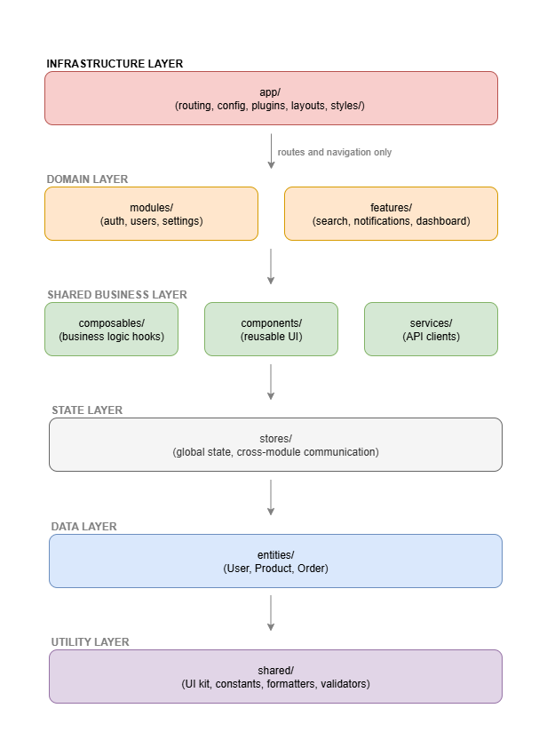

# Vue 3 Project Modules Blueprint

This document provides recommendations for structuring Vue 3 projects using **modules**.  
A module represents a domain (e.g., `auth`, `users`, `notifications`) and may contain **views, components, services, composables, and stores**.

**Key Concepts:**
- **Modules** = Domain-specific folders containing related functionality
- **Global assets** = Reusable code accessible by all modules (components/, composables/, entities/, features/)
- **App infrastructure** = Framework setup and configuration (app/ folder)
- **Shared utilities** = Basic UI kit and utility functions (shared/ folder)

---

## Example Project Structure

```plaintext
src/
├── app/                      # Infrastructure and global setup
│   ├── router/               # Route registration
│   │   └── index.ts
│   ├── stores/               # Pinia/Vuex root store setup
│   ├── plugins/              # Global plugins (axios, i18n, etc.)
│   ├── layouts/              # App-level layouts (DefaultLayout.vue, AuthLayout.vue)
│   └── App.vue               # Application root component
│
├── components/               # Global reusable components
│   ├── layout/               # Layout-related components
│   └── form/                 # Form-related components
│
├── composables/              # Global reusable composables
│   ├── useApi.ts
│   ├── useAuth.ts
│   └── useLocalStorage.ts
│
├── entities/                 # Global business entities
│   ├── base/
│   ├── User.ts
│   └── Permission.ts
│
├── features/                 # Global reusable features
│   ├── search/
│   ├── file-upload/
│   ├── data-table/
│   └── notifications/
│
├── modules/
│   ├── auth/                 # Route-based module
│   │   ├── views/
│   │   │   ├── LoginView.vue
│   │   │   ├── RegisterView.vue
│   │   │   └── ForgotPasswordView.vue
│   │   ├── components/
│   │   │   └── LoginForm.vue
│   │   ├── services/
│   │   │   └── auth.api.ts
│   │   ├── composables/
│   │   │   └── useLogin.ts
│   │   ├── store/
│   │   │   └── useAuthStore.ts
│   │   ├── entities/         # Business/domain entities for auth
│   │   └── routes.ts
│   │
│   ├── users/                # Another route-based module
│   │   ├── views/
│   │   │   ├── UserListView.vue
│   │   │   ├── UserDetailView.vue
│   │   │   └── UserEditView.vue
│   │   ├── components/
│   │   │   └── UserTable.vue
│   │   ├── services/
│   │   │   └── users.api.ts
│   │   ├── composables/
│   │   │   └── useUsers.ts
│   │   ├── entities/         # Business/domain entities for users
│   │   ├── routes.ts
│   │   ├── menu.ts
│   │   └── index.ts
│   │
│   ├── notifications/        # Logic-only module (no views)
│   │   ├── composables/
│   │   │   └── useNotifications.ts
│   │   ├── components/
│   │   │   └── Toast.vue
│   │   ├── entities/         # Business/domain entities for notifications
│   │   └── store/
│   │       └── useNotificationStore.ts
│   │
│   └── settings/             # Mixed module (routes + logic)
│       ├── views/
│       │   └── SettingsView.vue
│       ├── services/
│       │   └── settings.api.ts
│       ├── composables/
│       │   └── useSettings.ts
│       └── entities/         # Business/domain entities for settings
│
├── shared/                   # Cross-module utilities and UI kit
│   ├── ui/                   # Basic UI kit (buttons, inputs, forms, etc.)
│   ├── constants.ts          # App-wide constants
│   ├── formatters.ts         # Data formatting utilities  
│   ├── validators.ts         # Validation functions
│   ├── helpers.ts            # General helper functions
│   └── types.ts              # Shared TypeScript types
│
└── main.ts                   # Application entry point
```

---

## What belongs where?

**Within each module:**

- **views/** → Pages mapped to routes (e.g., `LoginView.vue`, `UserListView.vue`).  
- **components/** → UI parts specific to the module (not shared globally).  
- **services/** → API calls or domain logic (e.g., `auth.api.ts`).  
- **composables/** → Hooks with stateful or computed logic (e.g., `useUsers.ts`).  
- **store/** → Module-specific Pinia/Vuex stores (e.g., `useAuthStore.ts`).  
- **entities/** → Business/domain entities specific to this module.  
- **routes.ts** → Defines routes for this module.  
- **menu.ts** → Navigation items for this module (if applicable).

**Note:** Global stores (shared across modules) go in `app/stores/`, while module-specific stores go in `modules/<module-name>/store/`.

**🏗️ Store Stability Principle:** Root stores (`app/stores/` or `src/stores/`) serve as the **foundational stability layer** for cross-module communication. They should have:
- **Minimal, stable public APIs** that rarely change
- **Backward-compatible evolution** (additive changes only)
- **Well-defined interfaces** that multiple modules depend on
- **Long-term consistency** as they are the primary integration points between modules

Changes to root stores affect multiple modules, so they require careful consideration and should follow semantic versioning principles.

---

## Routing Registration

### **🚨 The Routing Challenge**

**Problem:** Routing inherently requires knowing about module routes, but layer access rules forbid `app/` importing from `modules/`. Even registry patterns require *someone* to import modules to trigger registration.

### **Solution 1: Convention-Based Auto-Discovery (Recommended)**

Use file system conventions and dynamic imports to automatically discover and load module routes without any explicit imports:

```ts
// app/router/auto-discovery.ts
import type { RouteRecordRaw } from 'vue-router'

export async function discoverModuleRoutes(): Promise<RouteRecordRaw[]> {
  const routes: RouteRecordRaw[] = []
  
  // Use Vite's glob import to discover all module route files
  const moduleRoutes = import.meta.glob('/src/modules/*/routes.{ts,js}')
  
  for (const path in moduleRoutes) {
    try {
      const moduleRoute = await moduleRoutes[path]() as { default: RouteRecordRaw[] }
      routes.push(...moduleRoute.default)
    } catch (error) {
      console.warn(`Failed to load routes from ${path}:`, error)
    }
  }
  
  return routes
}
```

```ts
// app/router/index.ts
import { createRouter, createWebHistory } from "vue-router"
import { discoverModuleRoutes } from "./auto-discovery"

export async function createAppRouter() {
  const moduleRoutes = await discoverModuleRoutes()
  
  return createRouter({
    history: createWebHistory(),
    routes: [
      // App-level routes
      { path: '/', redirect: '/dashboard' },
      { path: '/404', component: () => import('@/shared/components/NotFound.vue') },
      
      // Auto-discovered module routes
      ...moduleRoutes,
      
      // Catch-all
      { path: '/:pathMatch(.*)*', redirect: '/404' }
    ]
  })
}
```

```ts
// main.ts - Still thin, no module imports!
import { createApp } from 'vue'
import { createAppRouter } from './app/router'
import App from './App.vue'

const app = createApp(App)
const router = await createAppRouter()

app.use(router).mount('#app')
```

### **Solution 2: Configuration-Based Discovery**

Define modules in configuration and load routes dynamically:

```ts
// app/config/modules.ts
export const enabledModules = [
  'auth',
  'users', 
  'settings',
  // Add new modules here when needed
] as const

export type ModuleName = typeof enabledModules[number]
```

```ts
// app/router/module-loader.ts
import type { RouteRecordRaw } from 'vue-router'
import { enabledModules } from '@/app/config/modules'

export async function loadModuleRoutes(): Promise<RouteRecordRaw[]> {
  const routes: RouteRecordRaw[] = []
  
  for (const moduleName of enabledModules) {
    try {
      // Dynamic import - no static dependency on modules
      const moduleRoutes = await import(`@/modules/${moduleName}/routes.ts`)
      routes.push(...moduleRoutes.default)
    } catch (error) {
      console.warn(`Module ${moduleName} routes not found or failed to load:`, error)
    }
  }
  
  return routes
}
```

```ts
// app/router/index.ts
import { createRouter, createWebHistory } from "vue-router"
import { loadModuleRoutes } from "./module-loader"

export async function createAppRouter() {
  const moduleRoutes = await loadModuleRoutes()
  
  return createRouter({
    history: createWebHistory(),
    routes: moduleRoutes
  })
}
```

### **Solution 3: Build-Time Route Generation**

Use a build plugin to generate routes at build time:

```ts
// vite.config.ts
import { defineConfig } from 'vite'
import { generateModuleRoutes } from './build/route-generator'

export default defineConfig({
  plugins: [
    generateModuleRoutes(), // Scans modules and generates route file
    // ... other plugins
  ]
})
```

```ts
// Generated file: app/router/generated-routes.ts (auto-generated)
export const moduleRoutes = [
  { path: '/auth/login', component: () => import('@/modules/auth/views/LoginView.vue') },
  { path: '/users', component: () => import('@/modules/users/views/UserListView.vue') },
  // ... auto-generated by scanning module files
]
```

**Key Benefits of These Solutions:**
- ✅ **No direct imports** from app to modules
- ✅ **Maintains layer isolation** 
- ✅ **Auto-discovery** of new modules
- ✅ **Keeps main.ts thin**
- ✅ **Dynamic module loading** support

```ts
// main.ts - Stays thin and focused
import { createApp } from 'vue'
import { router } from './app/router'
import App from './App.vue'

createApp(App).use(router).mount('#app')
```

## Module Navigation

Each module defines its own `menu.ts` for menu items related to that module:

```ts
// modules/users/menu.ts
import type { MenuItem } from "@/app/types"

export const userNav: MenuItem[] = [
  {
    title: 'User List',
    description: 'Manage system users',
    icon: 'Users',
    route: ROUTES.USERS_LIST,
  },
  {
    title: 'User Roles',
    description: 'User roles and permissions',
    icon: 'Shield',
    route: ROUTES.USER_ROLES,
  },
]
```

The app menu aggregator imports all module-level navigation and merges them:

```ts
// app/menu/index.ts
import { authNav } from "@/modules/auth/menu"
import { userNav } from "@/modules/users/menu"
import { settingsNav } from "@/modules/settings/menu"

export const navigation = [
  {
    title: 'Authentication',
    icon: 'Key',
    groups: [
      {
        title: 'General',
        items: [
          ...authNav,
        ]
      }
    ]
  },
  {
    title: 'Users',
    icon: 'Users',
    groups: [
      {
        title: 'Management',
        items: [
          ...userNav,
        ]
      }
    ]
  }
]
```

The sidebar component (e.g., `AppSidebar.vue`) consumes the aggregated menu and renders groups/items.

## Navigation Organization Patterns

### Navigation Structure Types

**1. Simple Navigation (Small Apps)**
```ts
// app/navigation/index.ts
export const navigation = [
  { title: 'Dashboard', route: '/dashboard', icon: 'Home' },
  { title: 'Users', route: '/users', icon: 'Users' },
  { title: 'Settings', route: '/settings', icon: 'Settings' },
]
```

**2. Grouped Navigation (Medium Apps)**
```ts
// app/navigation/index.ts
export const navigation = [
  {
    title: 'Management',
    items: [
      { title: 'Dashboard', route: '/dashboard', icon: 'Home' },
      { title: 'Users', route: '/users', icon: 'Users' },
      { title: 'Organizations', route: '/organizations', icon: 'Building' },
    ]
  },
  {
    title: 'System',
    items: [
      { title: 'Settings', route: '/settings', icon: 'Settings' },
      { title: 'Audit Logs', route: '/audit', icon: 'FileText' },
    ]
  }
]
```

**3. Hierarchical Navigation (Large Apps)**
```ts
// app/navigation/index.ts
export const navigation = [
  {
    title: 'General',
    icon: 'Home',
    groups: [
      {
        title: 'Overview',
        items: [
          { title: 'Dashboard', route: '/dashboard', icon: 'BarChart' },
          { title: 'Analytics', route: '/analytics', icon: 'TrendingUp' },
        ]
      }
    ]
  },
  {
    title: 'User Management',
    icon: 'Users',
    groups: [
      {
        title: 'Administration',
        items: [
          { title: 'User List', route: '/users', icon: 'Users' },
          { title: 'User Roles', route: '/users/roles', icon: 'Shield' },
          { title: 'Permissions', route: '/users/permissions', icon: 'Key' },
        ]
      },
      {
        title: 'Organization',
        items: [
          { title: 'Companies', route: '/organizations', icon: 'Building' },
          { title: 'Departments', route: '/departments', icon: 'Layers' },
        ]
      }
    ]
  }
]
```

### Module-Based Navigation Assembly

**Module Navigation Exports**
```ts
// modules/users/navigation.ts
export const usersNavigation = {
  title: 'User Management',
  icon: 'Users',
  groups: [
    {
      title: 'Administration',
      items: [
        { title: 'User List', route: '/users', icon: 'Users', permission: 'users:read' },
        { title: 'User Roles', route: '/users/roles', icon: 'Shield', permission: 'roles:read' },
        { title: 'Invite Users', route: '/users/invite', icon: 'UserPlus', permission: 'users:create' },
      ]
    }
  ]
}

// modules/auth/navigation.ts
export const authNavigation = {
  title: 'Authentication',
  icon: 'Key',
  groups: [
    {
      title: 'Security',
      items: [
        { title: 'Login Sessions', route: '/auth/sessions', icon: 'Clock', permission: 'auth:read' },
        { title: 'Password Policy', route: '/auth/policy', icon: 'Lock', permission: 'auth:manage' },
      ]
    }
  ]
}
```

**Navigation Aggregator**
```ts
// app/navigation/index.ts
import { userNav } from '@/modules/users/menu'
import { authNav } from '@/modules/auth/menu'
import { usePermissions } from '@/composables/usePermissions'

export function useAppNavigation() {
  const { hasPermission } = usePermissions()
  
  const moduleNavigations = [
    userNav,
    authNav,
  ]
  
  // Filter navigation items based on permissions
  const filteredNavigation = moduleNavigations.map(section => ({
    ...section,
    groups: section.groups.map(group => ({
      ...group,
      items: group.items.filter(item => 
        !item.permission || hasPermission(item.permission)
      )
    })).filter(group => group.items.length > 0)
  })).filter(section => section.groups.length > 0)
  
  return { navigation: filteredNavigation }
}
```

### Permission-Based Navigation

**Navigation with Role-Based Access**
```ts
// types/navigation.ts
export interface NavigationItem {
  title: string
  route: string
  icon: string
  permission?: string
  roles?: string[]
  badge?: {
    text: string
    variant: 'info' | 'warning' | 'success' | 'error'
  }
}

// app/navigation/guards.ts
export function filterNavigationByPermissions(
  navigation: NavigationItem[],
  userPermissions: string[],
  userRoles: string[]
): NavigationItem[] {
  return navigation.filter(item => {
    // Check permission-based access
    if (item.permission && !userPermissions.includes(item.permission)) {
      return false
    }
    
    // Check role-based access
    if (item.roles && !item.roles.some(role => userRoles.includes(role))) {
      return false
    }
    
    return true
  })
}
```

### Navigation Component Integration

**Sidebar Navigation Component**
```vue
<!-- components/AppSidebar.vue -->
<template>
  <nav class="sidebar">
    <div v-for="section in navigation" :key="section.title" class="nav-section">
      <h3 class="section-title">
        <Icon :name="section.icon" />
        {{ section.title }}
      </h3>
      
      <div v-for="group in section.groups" :key="group.title" class="nav-group">
        <h4 class="group-title">{{ group.title }}</h4>
        
        <ul class="nav-items">
          <li v-for="item in group.items" :key="item.route">
            <router-link :to="item.route" class="nav-link">
              <Icon :name="item.icon" />
              <span>{{ item.title }}</span>
              <Badge v-if="item.badge" :variant="item.badge.variant">
                {{ item.badge.text }}
              </Badge>
            </router-link>
          </li>
        </ul>
      </div>
    </div>
  </nav>
</template>

<script setup lang="ts">
import { useAppNavigation } from '@/app/navigation'

const { navigation } = useAppNavigation()
</script>
```

### Responsive Navigation Patterns

**Breadcrumb Navigation**
```ts
// composables/useBreadcrumbs.ts
export function useBreadcrumbs() {
  const route = useRoute()
  
  const breadcrumbs = computed(() => {
    const segments = route.path.split('/').filter(Boolean)
    const crumbs = []
    
    segments.reduce((path, segment) => {
      path += `/${segment}`
      const routeRecord = router.resolve(path)
      
      crumbs.push({
        title: routeRecord.meta?.breadcrumb || segment,
        path: path,
        isActive: path === route.path
      })
      
      return path
    }, '')
    
    return crumbs
  })
  
  return { breadcrumbs }
}
```

This navigation organization system provides flexibility for apps of any size while maintaining module independence and supporting advanced features like permissions and responsive design.

---

## Naming Conventions

- **Views** → Always end with `View.vue` → `LoginView.vue`, `UserListView.vue`.  
- **Components** → PascalCase, descriptive → `UserTable.vue`, `LoginForm.vue`.  
- **Stores** → Use Pinia convention: `useXxxStore.ts`.  
- **Composables** → Always start with `useXxx.ts`.  
- **Services** → `<domain>.api.ts` for API clients (e.g., `auth.api.ts`).  
- **Entities** → `<domain>.ts` for business/domain entities (e.g., `User.ts`, `Settings.ts`).  
- **Routes** → `routes.ts` inside module.  

---

## Architectural Principles

### **Layer-Based Access Control**

The modular architecture follows a strict layered approach where each layer has specific accessibility rules:

#### **🔴 Infrastructure Layer (`app/`)**
- **Access**: Can import from all layers except modules
- **Purpose**: Framework setup, routing, global configuration, global styles
- **Stability**: High - foundational infrastructure
- **Contains**: `router/`, `stores/`, `plugins/`, `layouts/`, `styles/`

#### **🟡 Domain Layers (`modules/`, `features/`)**
- **Access**: Can import from shared layers (🟢🟣🔘) but NOT from each other
- **Purpose**: Business logic and domain-specific functionality  
- **Isolation**: Strict - no cross-domain imports

#### **🔵 Data Layer (`entities/`)**
- **Access**: Can import from utilities (🟣) only
- **Purpose**: Pure data models and business objects
- **Stability**: High - core data contracts

#### **🟢 Shared Business Layer (`composables/`, `components/`)**
- **Access**: Can cross-reference each other and import from lower layers (🟣🔘)
- **Purpose**: Reusable business logic and UI components
- **Cross-referencing**: ✅ Allowed between composables/components

#### **🟢 Service Layer (`services/`)**  
- **Access**: Can import from entities (🔵), utilities (🟣), and stores (🔘)
- **Purpose**: API clients, external integrations, shared services
- **Cross-referencing**: ❌ Services should NOT import from each other to avoid circular dependencies

#### **🟣 Utility Layer (`shared/`)**
- **Access**: Self-contained - no imports from other layers
- **Purpose**: Pure utilities, UI kit, constants, formatters, validators
- **Organization**: Flat structure organized by purpose (not generic `utils/` folder)
- **Stability**: Highest - foundation layer
- **Examples**: `shared/ui/`, `shared/constants.ts`, `shared/formatters.ts`, `shared/validators.ts`

#### **🔘 State Layer (`stores/`)**
- **Access**: Can import from entities (🔵) and utilities (🟣)
- **Purpose**: Global state management and cross-module communication
- **Stability**: Highest - application kernel

---

## 📊 **Layer Access Diagram**

### **Visual Hierarchy: Top-to-Bottom Access Flow**



### **Access Flow Legend**

- **⬇️  Allowed** - Can import from layers below
- **🔄 Infrastructure Access** - App layer special access to integration points
- **↔️  Cross-Reference** - Horizontal imports within same layer
- **❌ Forbidden** - Cannot import from these layers
- **⚠️  Conditional** - Limited imports with restrictions
- **🔒 Self-Contained** - No external imports

### **Key Access Rules Summary**

| **Layer** | **Can Import From** | **Special Notes** |
|-----------|-------------------|------------------|
| 🔴 **app/** | All layers except modules | Infrastructure access to routes/plugins only |
| 🟡 **modules/** | Business, Data, Utility, State layers | ❌ No cross-module imports |
| 🟡 **features/** | Business, Data, Utility, State layers | ❌ No cross-feature imports |
| 🔵 **entities/** | Other entities, Utility layer | ↔️ Entity relationships allowed |
| 🟢 **composables/** | Entities, Components, Services, Utility, State | ↔️ Cross-reference with components |
| 🟢 **components/** | Entities, Composables, Utility, State | ↔️ Cross-reference with composables |
| 🟢 **services/** | Entities, Utility, State layers | ❌ No service cross-imports |
|  **shared/** | Nothing (self-contained) | 🔒 Foundation layer |
| 🔘 **stores/** | Entities, Utility layers | ⚠️ Limited cross-store imports |

**Note:** `app/styles/` is part of the infrastructure layer and managed by `app/` - no separate access control needed.

---

### **Original Architectural Principles**

1. **Module isolation:** Modules should not import from each other directly. Instead, shared functionality should be moved to global directories (`components/`, `composables/`, `entities/`, `features/`) or the `shared/` folder.
2. **Global accessibility:** Global assets (`components/`, `composables/`, `entities/`, `features/`) are accessible by all modules.
3. **UI kit separation:** Basic UI components (buttons, inputs, forms) belong in `shared/ui/`, while business components go in `components/`.
4. **Utilities only in shared:** The `shared/` directory is reserved for true utilities and the UI kit.
5. **Feature-based organization:** Group related functionality within modules.
6. **Layer respect:** Each layer can only import from allowed layers according to the access control matrix.

### **Layer Access Control Matrix**

| From ↓ / To → | `app/` | `modules/` | `features/` | `composables/` | `components/` | `services/` | `stores/` | `entities/` | `shared/` |
|---------------|--------|------------|-------------|----------------|---------------|-------------|-----------|-------------|-----------|
| **`app/`** | ✅ | 🔄 | 🔄 | ✅ | ✅ | ✅ | ✅ | ✅ | ✅ |
| **`modules/`** | ❌ | ❌ | ✅ | ✅ | ✅ | ✅ | ✅ | ✅ | ✅ |
| **`features/`** | ❌ | ❌ | ❌ | ✅ | ✅ | ✅ | ✅ | ✅ | ✅ |
| **`composables/`** | ❌ | ❌ | ❌ | ✅ | ✅ | ✅ | ✅ | ✅ | ✅ |
| **`components/`** | ❌ | ❌ | ❌ | ✅ | ✅ | ✅ | ✅ | ✅ | ✅ |
| **`services/`** | ❌ | ❌ | ❌ | ❌ | ❌ | ❌ | ✅ | ✅ | ✅ |
| **`stores/`** | ❌ | ❌ | ❌ | ❌ | ❌ | ❌ | ❌ | ✅ | ✅ |
| **`entities/`** | ❌ | ❌ | ❌ | ❌ | ❌ | ❌ | ❌ | ✅ | ✅ |
| **`shared/`** | ❌ | ❌ | ❌ | ❌ | ❌ | ❌ | ❌ | ❌ | ✅ |

**Legend:**
- ✅ **Allowed** - Can import freely
- ❌ **Forbidden** - Cannot import 
- 🔄 **Infrastructure Access** - App can access specific exports (routes, public APIs) for integration purposes

### **App Layer Infrastructure Access Rules**

The `app/` layer has special **infrastructure access** to modules and features for integration purposes:

#### **✅ Allowed App → Module/Feature Imports:**
```ts
// ✅ Routing infrastructure
import authRoutes from '@/modules/auth/routes'
import userRoutes from '@/modules/users/routes'
import searchFeatureRoutes from '@/features/search/routes'

// ✅ Public module APIs (explicit exports)
import { AuthPlugin } from '@/modules/auth'
import { UserManagement } from '@/modules/users'

// ✅ Navigation and menu structures
import authMenu from '@/modules/auth/menu'
import userMenu from '@/modules/users/menu'
```

#### **❌ Forbidden App → Module/Feature Imports:**
```ts
// ❌ Internal module components
import LoginForm from '@/modules/auth/components/LoginForm.vue'

// ❌ Internal composables
import { useAuth } from '@/modules/auth/composables/useAuth'

// ❌ Internal services
import { authAPI } from '@/modules/auth/services/auth.api'

// ❌ Internal stores
import { useAuthStore } from '@/modules/auth/store/useAuthStore'
```

**Key Principle:** App layer can access **integration points** (routes, public APIs, menus) but not **internal implementation details** (components, composables, services).

---

## Module Boundaries and Encapsulation

### **What are "Boundaries"?**

**Boundaries** in modular architecture define what parts of a module are **public** (accessible from outside) vs **private** (internal implementation). Good boundaries enable:

- **Loose coupling** between modules
- **High cohesion** within modules  
- **Controlled interfaces** for integration
- **Independent evolution** of modules

### **Public vs Private Module APIs**

#### **✅ Public Integration Points** (External Access Allowed)
```typescript
// modules/auth/
├── routes.ts              // ✅ PUBLIC - App needs for routing
├── menu.ts                // ✅ PUBLIC - App needs for navigation  
├── index.ts               // ✅ PUBLIC - Explicit module exports
└── plugins/
    └── auth-plugin.ts     // ✅ PUBLIC - App infrastructure plugins
```

#### **❌ Private Implementation Details** (Internal Only)
```typescript
// modules/auth/
├── components/            // ❌ PRIVATE - Internal UI components
├── composables/           // ❌ PRIVATE - Internal business logic
├── services/              // ❌ PRIVATE - Internal API calls
├── store/                 // ❌ PRIVATE - Internal state management
└── entities/              // ❌ PRIVATE - Internal data structures
```

### **Boundary Enforcement Strategies**

#### **1. Explicit Public APIs**
```ts
// modules/auth/index.ts - Public API definition
export { default as routes } from './routes'
export { default as menu } from './menu'
export { AuthPlugin } from './plugins/auth-plugin'

// ✅ App imports only public API
import { routes as authRoutes, AuthPlugin } from '@/modules/auth'

// ❌ App cannot import internal details
import LoginForm from '@/modules/auth/components/LoginForm.vue' // Would fail
```

#### **2. File-Level Access Control**
```ts
// Only specific files are accessible to app layer:
// ✅ @/modules/*/routes.ts    - Routing integration
// ✅ @/modules/*/menu.ts      - Navigation integration  
// ✅ @/modules/*/index.ts     - Public API exports
// ✅ @/modules/*/plugins/*    - App-level plugins

// ❌ All other paths are private to the module
```

### **Feature Isolation Principles**

#### **🚨 Critical Rule: Features Must Be Completely Isolated**

Features are **independent units of functionality** that should never depend on each other:

```ts
// ❌ FORBIDDEN - Feature importing from another feature
// features/search/components/SearchBar.vue
import UserFilter from '@/features/user-management/components/UserFilter.vue'

// ❌ FORBIDDEN - Feature importing feature logic
// features/notifications/composables/useNotifications.ts  
import { useSearch } from '@/features/search/composables/useSearch'

// ❌ FORBIDDEN - Cross-feature dependencies
// features/dashboard/services/dashboard.api.ts
import { searchAPI } from '@/features/search/services/search.api'
```

#### **✅ Correct Feature Communication Patterns**

If features need to share functionality, use these patterns:

```ts
// ✅ OPTION 1: Move shared logic to global layers
// composables/useSearch.ts (global)
export function useSearch() { /* shared search logic */ }

// features/search/composables/useFeatureSearch.ts
import { useSearch } from '@/composables/useSearch'  // Global composable

// features/dashboard/composables/useDashboardSearch.ts  
import { useSearch } from '@/composables/useSearch'  // Same global composable
```

```ts
// ✅ OPTION 2: Use shared entities and stores
// stores/searchStore.ts (global)
export const useSearchStore = defineStore('search', () => {
  // Shared search state
})

// features/search/components/SearchBar.vue
import { useSearchStore } from '@/stores/searchStore'

// features/dashboard/components/DashboardSearch.vue
import { useSearchStore } from '@/stores/searchStore'  // Same store
```

```ts
// ✅ OPTION 3: Event-driven communication via app layer
// app/events/search-events.ts
export const searchEvents = {
  onSearchTriggered: (query: string) => { /* emit event */ },
  onSearchCompleted: (results: any[]) => { /* emit event */ }
}

// Features communicate through events, not direct imports
```

**Key Benefits of Feature Isolation:**
- **Independent development** - Teams can work on features separately
- **Easy testing** - Features can be tested in isolation
- **Simple deployment** - Features can be deployed independently  
- **Reduced coupling** - Changes in one feature don't break others
- **Clear boundaries** - No ambiguity about feature responsibilities

### **Entity Domain Relationships**

#### **✅ Entities Can Import Other Entities (Same Domain)**

Entities represent **business domain concepts** that naturally relate to each other. They should be able to reference and compose with other entities within the same domain:

```ts
// ✅ ALLOWED - Entity importing related entities
// entities/User.ts
import { Role } from '@/entities/Role'
import { Permission } from '@/entities/Permission'
import { Address } from '@/entities/Address'

export interface User {
  id: string
  name: string
  email: string
  role: Role                    // ✅ Related entity
  permissions: Permission[]     // ✅ Related entity array
  address: Address             // ✅ Composed entity
  createdAt: Date
}
```

```ts
// ✅ ALLOWED - Entity compositions and relationships
// entities/Order.ts
import { User } from '@/entities/User'
import { Product } from '@/entities/Product'
import { PaymentMethod } from '@/entities/PaymentMethod'

export interface Order {
  id: string
  customer: User               // ✅ References User entity
  items: OrderItem[]          
  payment: PaymentMethod       // ✅ References PaymentMethod entity
  total: Money
}

export interface OrderItem {
  product: Product            // ✅ References Product entity
  quantity: number
  price: Money
}
```

```ts
// ✅ ALLOWED - Entity inheritance and extension
// entities/BaseEntity.ts
export interface BaseEntity {
  id: string
  createdAt: Date
  updatedAt: Date
}

// entities/User.ts
import { BaseEntity } from '@/entities/BaseEntity'

export interface User extends BaseEntity {  // ✅ Extends base entity
  name: string
  email: string
}
```

**Why Entity Cross-Imports Are Allowed:**
- **Domain cohesion** - Related business concepts belong together
- **Type safety** - Strong typing for entity relationships
- **Reusability** - Entities can be composed and extended
- **Business logic integrity** - Domain rules can be properly modeled

#### **❌ What Entities Should NOT Import**
```ts
// ❌ FORBIDDEN - Entities importing business logic
import { useUserStore } from '@/stores/userStore'        // Business logic
import { UserService } from '@/services/userService'     // API logic  
import UserForm from '@/components/UserForm.vue'         // UI components
```

Entities should remain **pure data structures** and **domain models** without dependencies on business logic, UI, or infrastructure layers.

### **Style Isolation Principles**

#### **🚨 Critical Rule: Modules and Features Cannot Import Global Styles**

Modules and features should maintain **style encapsulation** to avoid coupling and conflicts:

```scss
/* ❌ FORBIDDEN - Module/Feature importing global styles */
// modules/auth/components/LoginForm.vue
<style lang="scss">
@import '@/app/styles/globals.scss';        // ❌ Global style import
@import '@/app/styles/variables.scss';      // ❌ Global variables
@import '@/app/styles/mixins.scss';         // ❌ Global mixins

.login-form {
  @extend .global-form;                 // ❌ Extending global classes
}
</style>
```

#### **✅ Correct Style Patterns for Modules/Features**

1. **Self-Contained Styles**
   ```scss
   // modules/auth/components/LoginForm.vue
   <style lang="scss" scoped>
   .login-form {
     padding: 1rem;
     border: 1px solid #ccc;
     border-radius: 4px;
     
     &__input {
       margin-bottom: 1rem;
       width: 100%;
     }
     
     &__button {
       background: #007bff;
       color: white;
       padding: 0.5rem 1rem;
     }
   }
   </style>
   ```

2. **Module-Specific Style Files**
   ```scss
   // modules/auth/styles/_auth-variables.scss
   $auth-primary-color: #007bff;
   $auth-border-radius: 4px;
   $auth-spacing: 1rem;
   
   // modules/auth/components/LoginForm.vue
   <style lang="scss" scoped>
   @import '../styles/auth-variables';  // ✅ Module-local styles
   
   .login-form {
     border-radius: $auth-border-radius;
     padding: $auth-spacing;
   }
   </style>
   ```

3. **CSS Custom Properties (Recommended)**
   ```scss
   // App-level: app/styles/css-properties.scss (applied globally)
   :root {
     --primary-color: #007bff;
     --border-radius: 4px;
     --spacing-unit: 1rem;
   }
   
   // modules/auth/components/LoginForm.vue
   <style lang="scss" scoped>
   .login-form {
     background: var(--primary-color);    // ✅ CSS custom properties
     border-radius: var(--border-radius);
     padding: var(--spacing-unit);
   }
   </style>
   ```

#### **Why Style Isolation Matters**

- **No style conflicts** - Modules can't accidentally override global styles
- **Independent styling** - Each module controls its own appearance
- **Easier maintenance** - Style changes are contained within modules
- **Better testing** - Modules can be tested in isolation
- **Theme flexibility** - Global themes through CSS custom properties only

#### **✅ What App Layer Can Do with Styles**
```scss
// ✅ App layer can import and organize global styles
// app/styles/main.scss
@import 'variables';
@import 'globals';
@import 'themes';

// ✅ App layer applies CSS custom properties globally
:root {
  --primary-color: #{$primary-color};
  --spacing: #{$base-spacing};
}
```

**Key Principle:** Modules and features use **CSS custom properties** for theming and **scoped styles** for encapsulation, never direct global style imports.

### **Detailed Access Rules**

#### **🟢 Green Layer Cross-Referencing Rules:**

1. **`composables/` ↔ `components/`**: ✅ **Full cross-referencing allowed**
   ```javascript
   // ✅ Composable can use components
   import DataTable from '@/components/DataTable.vue'
   
   // ✅ Component can use composables  
   import { useApi } from '@/composables/useApi'
   ```

2. **`services/` cross-referencing**: ❌ **Forbidden**
   ```javascript
   // ❌ Services should not import from each other
   import { authService } from '@/services/auth'  // from userService
   
   // ✅ Use dependency injection or shared stores instead
   import { useAuthStore } from '@/stores/auth'
   ```

3. **`styles/` cross-referencing**: ❌ **Forbidden**
   ```javascript
   // ❌ Don't import styles from each other
   @import '@/app/styles/user-theme.scss';
   
   // ✅ Use CSS custom properties instead
   :root {
     --user-primary-color: var(--primary-color);
   }
   ```

## Where to put features?

**What is a feature?** A feature is a self-contained piece of functionality that typically includes multiple related files (components, composables, services, entities) working together to provide a specific capability.

- **Reusable features (used by multiple modules):**
  Place in `features/` (e.g., `features/search/`, `features/file-upload/`).
- **Domain-specific features (used by one module):**
  Place in `modules/<module-name>/features/` (e.g., `modules/users/features/user-invite/`).

Examples of features: search functionality, file upload system, data export, notification system, user invitation workflow.

## Where to put complex UI components?

- **Global complex components (used across modules):**
  Place in `components/` (e.g., `components/DataTable.vue`, `components/FileUploader.vue`).
- **Module-specific complex components:**
  Place in `modules/<module-name>/components/` (e.g., `modules/users/components/UserInviteForm.vue`).

Complex components are reusable UI blocks that contain business logic or advanced functionality, as opposed to basic UI kit elements.

## UI Kit vs Business Components

- **UI Kit components (`shared/ui/`):**
  Basic, generic UI elements like buttons, inputs, forms, modals, etc.
  ```js
  // Examples:
  import Button from '@/shared/ui/Button.vue'
  import Input from '@/shared/ui/Input.vue'
  import Modal from '@/shared/ui/Modal.vue'
  ```

- **Business components (`components/`):**
  Application-specific components that contain business logic or complex functionality.
  ```js
  // Examples:
  import UserCard from '@/components/UserCard.vue'
  import DataTable from '@/components/DataTable.vue'
  import SearchFilters from '@/components/SearchFilters.vue'
  ```

The UI kit provides the building blocks, while business components use these blocks to create meaningful application features.

## What remains in the shared folder?

The `shared/` directory now contains only two categories of truly shared code:

- **`shared/ui/`** - Basic UI kit components (buttons, inputs, forms, modals, etc.)
  - Generic, stateless components with no business logic
  - Design system building blocks used to construct complex components
  - Examples: `Button.vue`, `Input.vue`, `Modal.vue`, `Card.vue`

- **`shared/utils/`** - Pure utility functions and constants
  - Formatters, validators, helpers with no side effects
  - Application constants and common type definitions
  - Examples: `formatters.ts`, `validators.ts`, `constants.ts`

Everything else (business components, composables, entities, features) has been moved to root-level directories for better accessibility and cleaner import paths.

## Where to put business entities?

**What are entities?** Entities are TypeScript interfaces, types, or classes that represent business domain objects, data models, or API response structures.

- **Global entities (used across modules):**
  Place in `entities/` (e.g., `entities/User.ts`, `entities/ApiResponse.ts`).
  These are core business objects referenced by multiple modules.

- **Module-specific entities:**
  Place in `modules/<module-name>/entities/` (e.g., `modules/users/entities/UserPreferences.ts`).
  These are domain objects specific to one module's business logic.

**Examples:**
- Global: `User`, `Permission`, `ApiResponse`, `PaginationMeta`
- Module-specific: `UserInvitation` (users module), `LoginAttempt` (auth module)

## Global vs. Module-Specific Organization

### Global Components (`components/`)
Global components are reusable UI elements used across multiple modules. They should be:
- **Generic and reusable** (e.g., `Button.vue`, `Modal.vue`, `DataTable.vue`)
- **Not tied to specific business logic**
- **Stateless or use props/events for communication**

```plaintext
components/
├── layout/               # Layout-related components
│   ├── AppHeader.vue
│   ├── AppSidebar.vue
│   └── AppFooter.vue
└── form/                 # Form-related components
    ├── FormField.vue
    ├── FormSelect.vue
    └── FormDatePicker.vue
```

### Global Composables (`composables/`)
Global composables provide cross-cutting functionality used by multiple modules:
- **Utility functions** (e.g., `useLocalStorage.ts`, `useDebounce.ts`)
- **Common business logic** (e.g., `useApi.ts`, `useAuth.ts`)
- **Framework utilities** (e.g., `useRouter.ts`, `useI18n.ts`)

```plaintext
composables/
├── useApi.ts             # HTTP client wrapper
├── useAuth.ts            # Authentication state
├── useLocalStorage.ts    # Local storage utilities
├── useDebounce.ts        # Debouncing utility
├── usePermissions.ts     # Authorization logic
└── useValidation.ts      # Form validation helpers
```

### Global Entities (`entities/`)
Global entities represent core business objects used across the application:
- **Base models** (e.g., `BaseEntity.ts`, `ApiResponse.ts`)
- **Cross-module domain objects** (e.g., `User.ts`, `Permission.ts`)
- **Common types** (e.g., `ApiError.ts`, `PaginationMeta.ts`)

```plaintext
entities/
├── base/                 # Base entity types
│   ├── BaseEntity.ts
│   ├── ApiResponse.ts
│   └── PaginationMeta.ts
├── User.ts               # Global user entity
├── Permission.ts         # Permission model
├── ApiError.ts           # Error handling types
└── index.ts              # Export all entities
```

**Example: Global User Entity**
```ts
// entities/User.ts
export interface User {
  id: string
  email: string
  firstName: string
  lastName: string
  role: UserRole
  permissions: Permission[]
  createdAt: Date
  updatedAt: Date
}

export enum UserRole {
  ADMIN = 'admin',
  USER = 'user',
  MODERATOR = 'moderator'
}
```

### Global Features (`features/`)
Global features are complex, reusable functionality used across multiple modules:
- **Cross-cutting features** (e.g., search, notifications, file upload)
- **Complex UI patterns** (e.g., data tables with filters, wizards)
- **Business workflows** used by multiple modules

```plaintext
features/
├── search/               # Global search functionality
│   ├── components/
│   │   ├── SearchInput.vue
│   │   ├── SearchResults.vue
│   │   └── SearchFilters.vue
│   ├── composables/
│   │   └── useSearch.ts
│   ├── services/
│   │   └── search.api.ts
│   ├── entities/
│   │   └── SearchResult.ts
│   └── index.ts
├── file-upload/          # File upload feature
│   ├── components/
│   │   ├── FileUploader.vue
│   │   ├── FileProgress.vue
│   │   └── FilePreview.vue
│   ├── composables/
│   │   └── useFileUpload.ts
│   ├── services/
│   │   └── upload.api.ts
│   └── index.ts
├── data-table/           # Reusable data table
│   ├── components/
│   │   ├── DataTable.vue
│   │   ├── TableHeader.vue
│   │   ├── TableFilters.vue
│   │   └── TablePagination.vue
│   ├── composables/
│   │   ├── useDataTable.ts
│   │   ├── useTableFilters.ts
│   │   └── useTablePagination.ts
│   ├── entities/
│   │   └── TableConfig.ts
│   └── index.ts
└── notifications/        # Global notification system
    ├── components/
    │   ├── NotificationToast.vue
    │   ├── NotificationCenter.vue
    │   └── NotificationBell.vue
    ├── composables/
    │   └── useNotifications.ts
    ├── store/
    │   └── useNotificationStore.ts
    ├── entities/
    │   └── Notification.ts
    └── index.ts
```

**Example: Global Search Feature**
```ts
// features/search/index.ts
export { default as SearchInput } from './components/SearchInput.vue'
export { default as SearchResults } from './components/SearchResults.vue'
export { default as SearchFilters } from './components/SearchFilters.vue'
export { useSearch } from './composables/useSearch'
export * from './entities/SearchResult'

// Usage in modules:
// import { SearchInput, useSearch } from '@/features/search'
```

### Module-Specific vs. Global Decision Matrix

| Item | Global (Root Level) | Module-Specific (`modules/`) |
|------|-------------------|------------------------------|
| **Components** | UI primitives, layout components | Business-specific components |
| **Composables** | Utility functions, framework wrappers | Domain-specific logic |
| **Entities** | Core domain models, base types | Module-specific variations |
| **Features** | Cross-cutting functionality, reusable workflows | Domain-specific features |

**Examples:**
- `Button.vue` → Global (UI primitive)
- `UserForm.vue` → Module-specific (business logic)
- `useApi.ts` → Global (utility)
- `useUserManagement.ts` → Module-specific (domain logic)
- `User.ts` → Global (core entity)
- `UserPreferences.ts` → Module-specific (specific to user module)
- `search/` feature → Global (used across modules)
- `user-invite/` feature → Module-specific (specific to users module)

### Feature Organization Guidelines

**When to create a Global Feature (`features/`):**
- Used by 2+ modules
- Provides cross-cutting functionality
- Contains complex business logic or UI patterns
- Could be extracted as a separate package

**When to create a Module-Specific Feature (`modules/<module>/features/`):**
- Specific to one domain/module
- Contains domain-specific business logic
- Unlikely to be reused elsewhere
- Tightly coupled to module entities/services

## Feature-Oriented Module Example

A feature-oriented module organizes files by feature, not by type. Each feature is self-contained and may include its own components, composables, services, and views.

**Example: UserInvite feature in the users module**

```
src/
└── modules/
    └── users/
        ├── features/
        │   └── user-invite/
        │       ├── entities/
        │       │   └── UserInvite.ts
        │       ├── UserInviteForm.vue
        │       ├── useUserInvite.ts
        │       ├── userInvite.api.ts
        │       ├── UserInviteView.vue
        │       └── index.ts
        ├── components/
        ├── views/
        └── ...
```

- `features/user-invite/UserInviteForm.vue`: UI for inviting a new user
- `features/user-invite/useUserInvite.ts`: Composable for invite logic
- `features/user-invite/userInvite.api.ts`: API client for invites
- `features/user-invite/UserInviteView.vue`: Feature-specific view
- `features/user-invite/index.ts`: Feature exports

This keeps features self-contained, modular, and easy to maintain.

### Organizing Feature Folders: Flat vs. Subfolders

For small features, a flat structure (all files in the feature root) is simple and easy to navigate:

```
features/user-invite/
  UserInviteForm.vue
  useUserInvite.ts
  userInvite.api.ts
  UserInviteView.vue
  index.ts
```

For larger or more complex features, use subfolders by type for better scalability and clarity:

```
features/user-invite/
  components/
    UserInviteForm.vue
  composables/
    useUserInvite.ts
  services/
    userInvite.api.ts
  entities/
    UserInvite.ts
  views/
    UserInviteView.vue
  index.ts
```

Choose the structure that best fits the feature's complexity. Subfolders by type are recommended for features with many files or expected growth.

## Module vs. Feature Organization

- **Modules** are always organized as folders by domain (e.g., `users`, `auth`, `settings`). Each domain gets its own directory under `modules/`.
- **Features** inside modules can be organized either flat (all files in one folder) or with subfolders by type (e.g., `components/`, `composables/`, `entities/`, `services/`, `views/`). Choose flat or subfolder structure based on the feature's size and complexity.

This approach keeps the overall project modular, while allowing flexibility for feature organization as your codebase grows.

---

## Architectural Pattern Solutions

### **🚨 Routing and Navigation: True Decoupling Solutions**

**Problem:** The app layer needs access to module routes, but layer access rules forbid `app/` importing from `modules/`. Registry patterns still require someone to import modules.

**Solution:** Use **auto-discovery** or **configuration-based loading** to eliminate direct imports entirely:

#### **✅ Correct Approach (Auto-Discovery)**
```ts
// app/router/auto-discovery.ts - No module imports!
const moduleRoutes = import.meta.glob('/src/modules/*/routes.{ts,js}')

for (const path in moduleRoutes) {
  const module = await moduleRoutes[path]() // 🔄 Dynamic discovery
  routes.push(...module.default)
}
```

#### **✅ Alternative (Configuration-Based)**
```ts
// app/config/modules.ts - Explicit module list
export const enabledModules = ['auth', 'users', 'settings']

// app/router/loader.ts - Dynamic imports
for (const moduleName of enabledModules) {
  const routes = await import(`@/modules/${moduleName}/routes.ts`) // 🔄 Dynamic loading
}
```

#### **❌ Incorrect Approach (Any Direct Import)**
```ts
// ❌ Registry pattern still requires imports somewhere
import "@/modules/auth"      // Still violates layer rules
import authRoutes from "@/modules/auth/routes"  // Direct import violation
```

**Key Benefits:**
- **True layer isolation** - No static dependencies between layers
- **Auto-discovery** - New modules work automatically by convention  
- **Dynamic loading** - Enables code splitting and lazy loading
- **Thin main.ts** - All complexity stays in app infrastructure

---

## Quick Reference Guide

### **Directory Structure Summary**
```
src/
├── app/                  # Framework infrastructure (router, stores, plugins, layouts)
│   ├── router/           # App routing configuration
│   ├── stores/           # Global app stores
│   ├── plugins/          # App-level plugins
│   ├── layouts/          # App layouts
│   └── styles/           # Global styles (only accessible by app layer)
├── components/           # Global business components
├── composables/          # Global composables  
├── entities/             # Global business entities
├── features/             # Global cross-cutting features
├── modules/              # Domain-specific modules
├── shared/               # UI kit and utilities (organized by purpose)
├── App.vue               # Root component
└── main.ts               # Entry point
```

### **Decision Tree: Where to put code?**

**Is it a basic UI element (button, input, modal)?** → `shared/ui/`  
**Is it a utility function or constant?** → `shared/` (organized by purpose: `constants.ts`, `formatters.ts`, `validators.ts`, etc.)  
**Is it used by multiple modules?** → Global directory (`components/`, `composables/`, `entities/`, `features/`)  
**Is it specific to one domain?** → Module directory (`modules/<domain>/`)  
**Is it app infrastructure?** → `app/` directory  
**Is it module registration or complex initialization?** → `app/` directory, **NOT** `main.ts`

### **🎯 Key Principle: Keep `main.ts` Thin**
```ts
// ✅ GOOD - Only essential app initialization
import { createApp } from 'vue'
import { router } from './app/router'
import App from './App.vue'

createApp(App).use(router).mount('#app')
```

```ts
// ❌ BAD - Module registration in main.ts
import './modules/auth'      // Move to app/router/modules.ts
import './modules/users'     // Move to app/router/modules.ts
import './plugins/analytics' // Move to app/plugins/index.ts
```

### **Import Path Examples**
```js
// UI Kit
import Button from '@/shared/ui/Button.vue'

// Global assets
import UserCard from '@/components/UserCard.vue'
import { useApi } from '@/composables/useApi'
import { User } from '@/entities/User'
import { SearchInput } from '@/features/search'

// Module-specific
import LoginForm from '@/modules/auth/components/LoginForm.vue'
import { useAuth } from '@/modules/auth/composables/useAuth'
// or via public module export path
import LoginForm from '@/modules/auth'
import { useAuth } from '@/modules/auth'

// App infrastructure
import { router } from '@/app/router'
```
